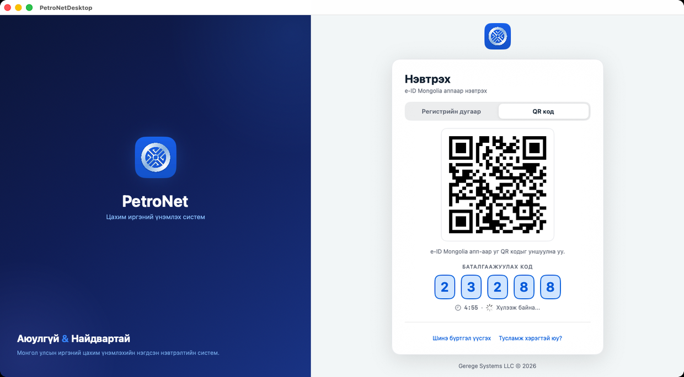
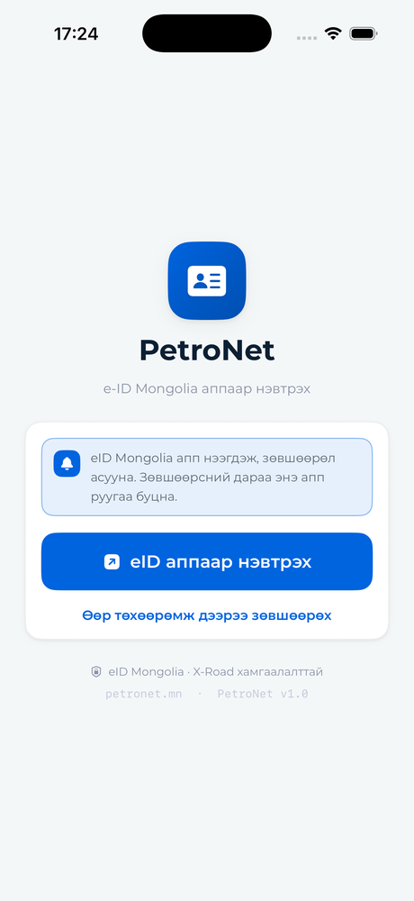
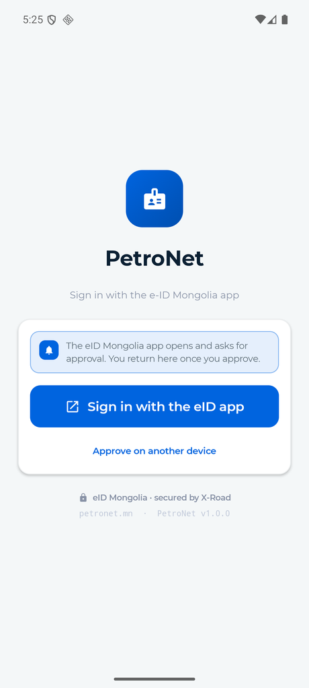
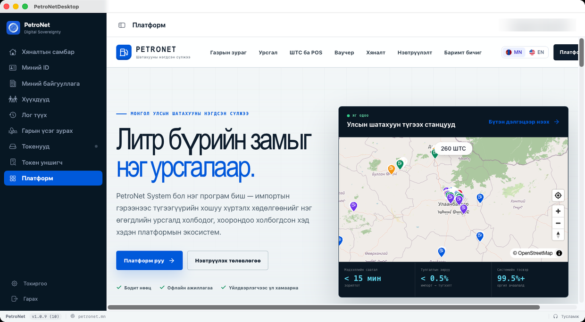
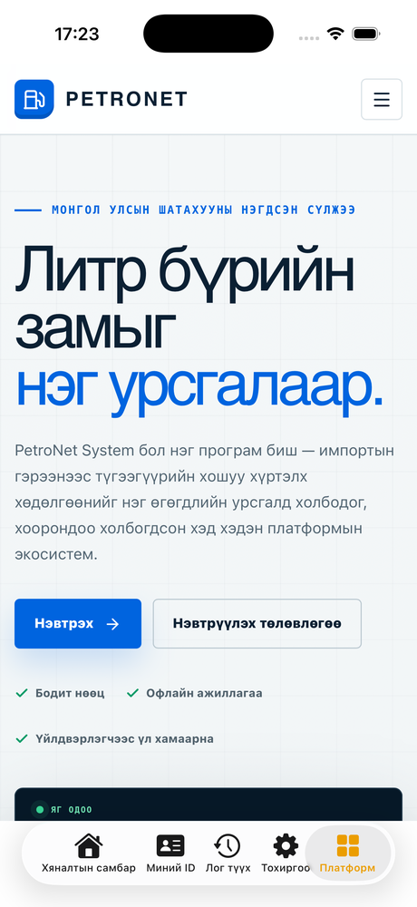
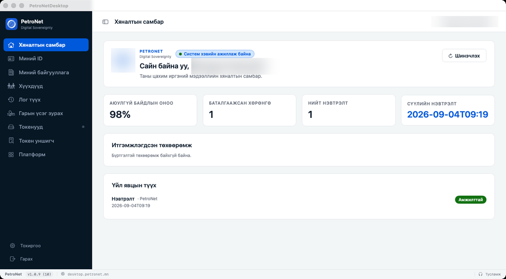
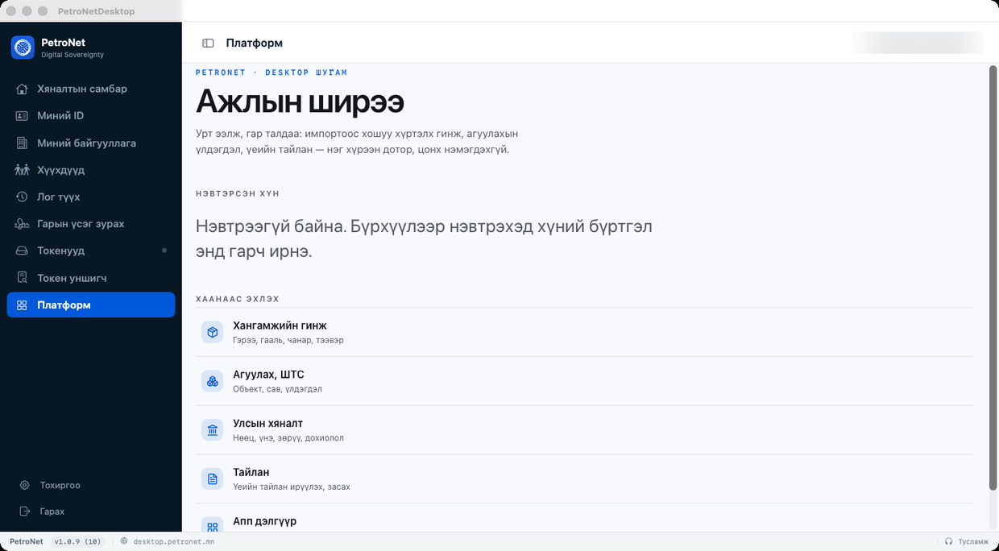
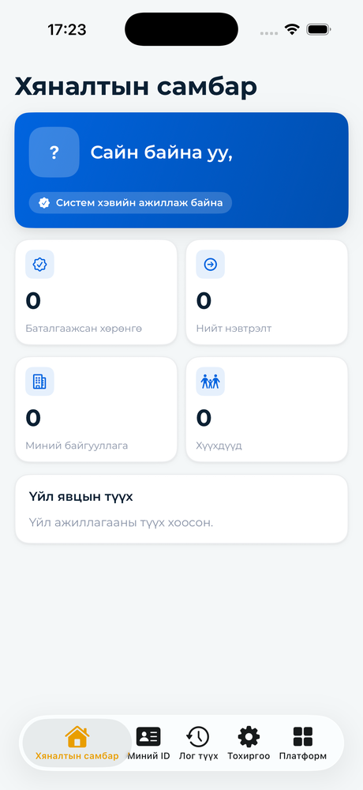
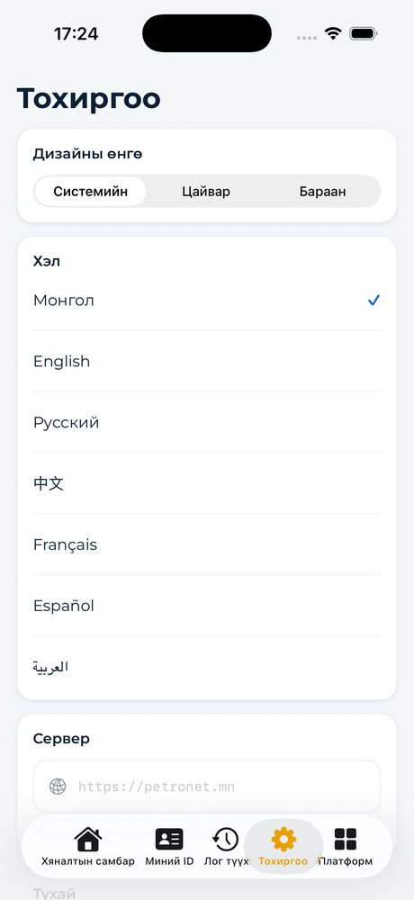

# Native клиентүүд

Дөрвөн клиент, хоёр шугам, нэг бүтээгдэхүүн. Энэ хуудсан дахь зураг бүр
**бодит апп**-аас авагдсан — макет ч биш, зурсан ч биш. Кодыг нь
[`native-apps/`](https://github.com/gerege-systems/petronet-gerege-nexus/tree/main/native-apps)
дотроос уншина.

[Баримтын төв](README.md) · [Bridge гэрээ](SHELL_CONTRACT.md) · [Байрлуулалт](DEPLOYMENT.md)

---

## Аппын нэр нь шугамаа дагана

| Шугам | Хаяг | Аппын нэр | Клиент |
| --- | --- | --- | --- |
| desktop | `desktop.petronet.mn` | **PetroNetDesktop** | macOS, Windows |
| mobile | `mobile.petronet.mn` | **PetroNetMobile** | iOS/iPadOS, Android |
| kiosk | `kiosk.petronet.mn` | **PetroNetKiosk** | ЗАХИАЛГАТАЙ — клиент хараахан байхгүй |
| pos | `pos.petronet.mn` | **PetroNetPos** | ЗАХИАЛГАТАЙ — клиент хараахан байхгүй |

Нэр нь ПЛАТФОРМЫГ биш, ТӨХӨӨРӨМЖИЙН ШУГАМЫГ нэрлэдэг. Ширээн дээрх Mac ба
ширээн дээрх Windows хоёр нэг апп байгаа нь алдаа биш: хүн тэр хоёрын аль
дээр нь ч сандал дээр суугаад, гар талдаа байлгаж ажилладаг тул дэлгэцийн
нягтрал, товчны хэмжээ, юуг эхэнд тавих нь ижил. Бүрхүүл өөрийгөө юу гэж
хэлж байгаа нь тусдаа зүйл бөгөөд `window.GeregeShell.platform` дээр хэвээр.

Иргэний харах нэр нь эдгээрийн аль нь ч биш — **PetroNet**.

---

## Нэвтрэлт — платформ бүрт өөр, session нь ижил

Ширээн дээр зөвшөөрөгч нь **хөрш утас** тул QR ба баталгаажуулах код гарна.
Гар утсан дээр зөвшөөрөгч нь **өөрөө тэр утас** — өөрийнхөө дэлгэц дээрх
QR-ыг скан хийж чадахгүй тул app-to-app үсэрнэ (`geregesmartid://approve`).

Гурвуулан ижил `POST /api/start` → `GET /api/status` дээр суудаг: session нь
хэн зөвшөөрснөөс үл хамааран ижил тул app-to-app-д НЭГ Ч шинэ backend
endpoint нэмээгүй.

### macOS — QR ба баталгаажуулах код

<figure markdown="span">
  
  <figcaption>macOS — QR ба таван оронтой баталгаажуулах код. Хажууд нь 5 минутын таймер.</figcaption>
</figure>

QR ба доорх таван орон нь **амьд backend-ээс** ирсэн бодит session — таймер
5 минут тоолж, дуусмагц код хүчингүй болно.

### iOS ба Android — app-to-app

<div class="grid" markdown>

<figure markdown="span">
  
  <figcaption>iOS · монголоор</figcaption>
</figure>

<figure markdown="span">
  
  <figcaption>Android · англиар</figcaption>
</figure>

</div>

Зүүн талд iOS монголоор, баруун талд Android англиар: ижил дэлгэц, ижил
урсгал, зөвхөн төхөөрөмжийн хэл өөр. Долоон хэлний мөрийг
[`sync-i18n.sh`](https://github.com/gerege-systems/petronet-gerege-nexus/blob/main/native-apps/sync-i18n.sh)
энэ репогийн frontend-ээс үүсгэдэг тул вэб ба апп нэг толь бичгээс уншина.

eID Mongolia апп суугаагүй бол «Өөр төхөөрөмж дээрээ зөвшөөрөх» зам үлдэнэ.

---

## Native хүрээ, вэб ажлын муж

Энэ бол архитектурын гол санаа: бүрхүүл нь нэвтрэлт, цэс, толгой хэсэг,
төхөөрөмжийн хандалтыг өөртөө авдаг; вэб апп нь өөрийн chrome-оо нуугаад
зөвхөн **ажлын муж** болж рендерлэгддэг. Хоёр тал
[Bridge гэрээ](SHELL_CONTRACT.md)-гээр ярина.

<figure markdown="span">
  
  <figcaption>macOS — зүүн талын хажуу цэс native, баруун талын бүх зүйл petronet.mn.</figcaption>
</figure>

Зүүн талын хар хажуу цэс, доод мөрийн `PetroNet v1.0.9 (10) · petronet.mn`
нь **native**. Баруун талын бүх зүйл — гарчиг, ШТС-уудын газрын зураг,
хэмжүүрүүд — нь `petronet.mn`-ий яг тэр хуудас.

<figure markdown="span">
  
  <figcaption>iOS — доод талын таб мөр native, дээрх бүх зүйл вэб.</figcaption>
</figure>

Утсан дээр ч ижил дүрэм: доод талын таб мөр native, дээрх бүх зүйл вэб.

### Шугам асаалттай үеийн бүтэн гинж

<figure markdown="span">
  
  <figcaption>Доод зүүн буланд <code>desktop.petronet.mn</code> — клиент өөрийн шугам дээр, ямар ч override-гүйгээр.</figcaption>
</figure>

<figure markdown="span">
  
  <figcaption>Тэр шугамын webview нь <code>/</code>-ыг <code>/line/desktop</code> болгож, «Ажлын ширээ»-г үзүүлж байна.</figcaption>
</figure>

Хоёр зураг нь гинжийг бүтнээр нь харуулна: клиент өөрийн хаягаар очиж, nginx
түүнийг frontend рүү дамжуулж, `proxy.ts` нь `Host`-оос шугамыг таниад тухайн
шугамын нүүр рүү чиглүүлж байна. «Нэвтрээгүй байна» гэдэг нь алдаа биш —
бүрхүүлийн нэвтрэлт ба webview-ийн cookie тусдаа.

---

## Ажлын дэлгэц ба тохиргоо

<div class="grid" markdown>

<figure markdown="span">
  
  <figcaption>Хяналтын самбар — session байхгүй тул тоонууд тэг.</figcaption>
</figure>

<figure markdown="span">
  
  <figcaption>Тохиргоо — долоон хэл, шугамын хаяг.</figcaption>
</figure>

</div>

Тохиргооны «Сервер» талбар нь тухайн клиентийн шугамыг харуулна —
`https://mobile.petronet.mn`. Тэр нэг мөр нь аппыг өөр байрлуулалт руу
чиглүүлэх цорын ганц зам бөгөөд түүнийг **хамгийн сүүлд** солино: DNS,
vhost, TLS, `DEVICE_LINE_ORIGINS` дөрвүүлэн бэлэн болохоос өмнө чиглүүлбэл
апп байхгүй host руу очиж унана.

<figure markdown="span">
  
  <figcaption>macOS хяналтын самбар. Нэвтэрсэн хүний нэрийг далдалсан.</figcaption>
</figure>

Хажуугийн цэсэн дэх «Токенууд», «Токен уншигч» хоёр нь ЗӨВХӨН ширээнийх:
PKCS#11 USB токен, `ws://127.0.0.1` дээрх eSign гүүр хоёр гар утсан дээр
байхгүй.

---

## Харагдац

Дөрвүүлэнгийн өнгө нь вэбийн палитраас (`frontend/app/petronet.css`)
гаралтай — иргэн хөтөч дээрх PetroNet ба гар дээрх PetroNet хоёрыг нэг
бүтээгдэхүүн гэж уншина.

| Токен | Утга | Хаана |
| --- | --- | --- |
| `pn-blue` | `#0064DF` | Үндсэн үйлдэл, холбоос, идэвхтэй мөр |
| `pn-navy` | `#061827` | Ширээний хажуу цэс, гүн дэвсгэр |
| `pn-orange` | `#F5A800` | Сонгогдсон таб, анхааруулга |
| `pn-green` | `#0D9B68` | Баталгаажсан, «болсон» |

Ширээ ба утас хоёрын дизайны токен ТУСДАА байдаг: ширээнийх Windows аппын
`Colors.xaml`-тай хосолсон (тэр хоёр клиент нэг л зүйл харагдах ёстой),
утасныхыг тусад нь барьдаг. Гар дээрх өөрчлөлт ширээ рүү давалгаа явуулах
ёсгүй.

---

## Эдгээр зургийг хэрхэн авсан бэ

Дахин авах боломжтой байхын тулд бичив.

```bash
# macOS
cd native-apps/desktop/macos && ./build.sh
API_BASE_URL=https://petronet.mn EID_DEBUG_TAB=platform \
  ~/Library/Developer/Xcode/DerivedData/PetroNetDesktop-*/Build/Products/Debug/PetroNetDesktop.app/Contents/MacOS/PetroNetDesktop

# iOS
cd native-apps/mobile/ios && ./build.sh
xcrun simctl install booted <…>/PetroNetMobile.app
SIMCTL_CHILD_API_BASE_URL=https://petronet.mn SIMCTL_CHILD_EID_DEBUG_TAB=platform \
  xcrun simctl launch --terminate-running-process booted mn.petronet.mobile
xcrun simctl io booted screenshot ios-platform.png

# Android
cd native-apps/mobile/android && ./gradlew assembleDebug
adb install -r app/build/outputs/apk/debug/app-debug.apk
adb exec-out screencap -p > android-login.png
```

`EID_DEBUG_TAB` нь **зөвхөн DEBUG build**-д ажилладаг: нэвтрэлт нь иргэний
утсанд push илгээдэг тул дэлгэцийн алдааг хөөж байгаа хүн бүр жинхэнэ
eID-ээр нэвтрэх шаардлагатай болдог байв. Release build-д энэ код БАЙХГҮЙ,
тиймээс нэвтрэлтийг тойрох зам ч байхгүй.

`API_BASE_URL` нь клиентийг өөр байрлуулалт руу заана. Энэ хуудсан дахь
зургууд авагдах үед төхөөрөмжийн шугамууд хараахан асаагүй байсан тул
`petronet.mn` гэж зааж байв. **2026-09-05-нд дөрвүүлэн асав** — одоо клиент
`API_BASE_URL`-гүйгээр, өөрийн анхдагч хаягаараа шууд ажиллана
([Байрлуулалт § Төхөөрөмжийн шугамууд](DEPLOYMENT.md#төхөөрөмжийн-шугамууд)).

**Хувь хүний мэдээллийг далдалсан.** Зурган дээрх бүдгэрсэн хэсгүүд нь
нэвтэрсэн хүний нэр. «Миний ID» дэлгэц нь регистрийн болон иргэний
бүртгэлийн дугаарыг харуулдаг тул энэ хуудсанд ОГТ оруулаагүй — бусад бүх
тоо, огноо, хаяг бодит хэвээр.
