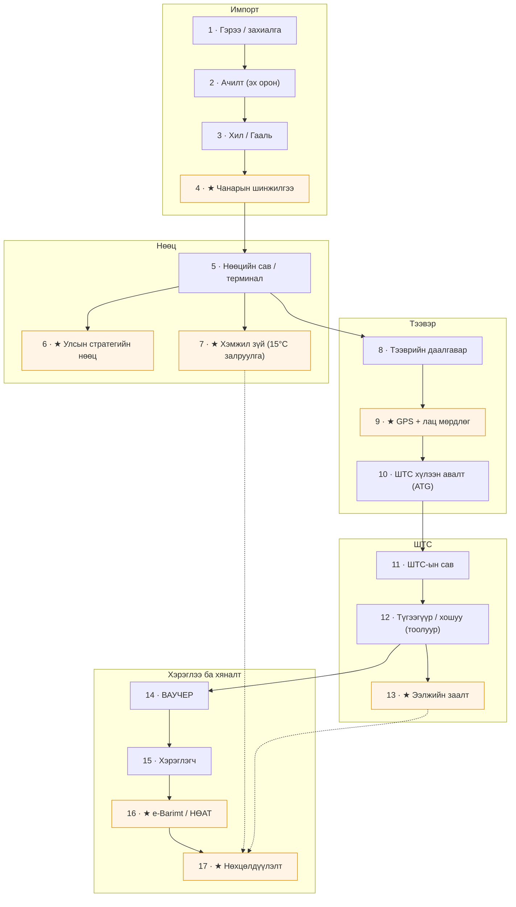
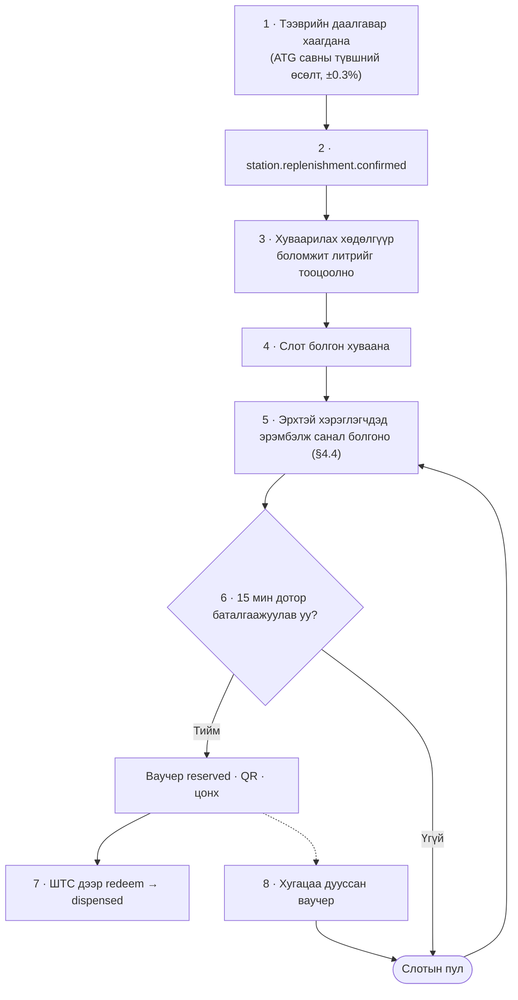
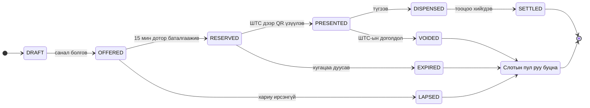
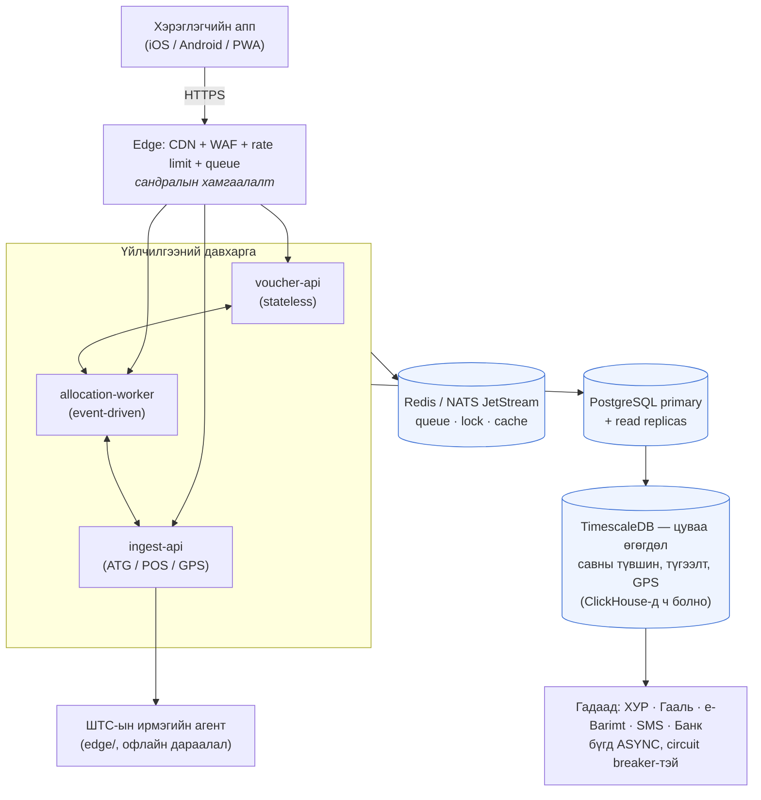
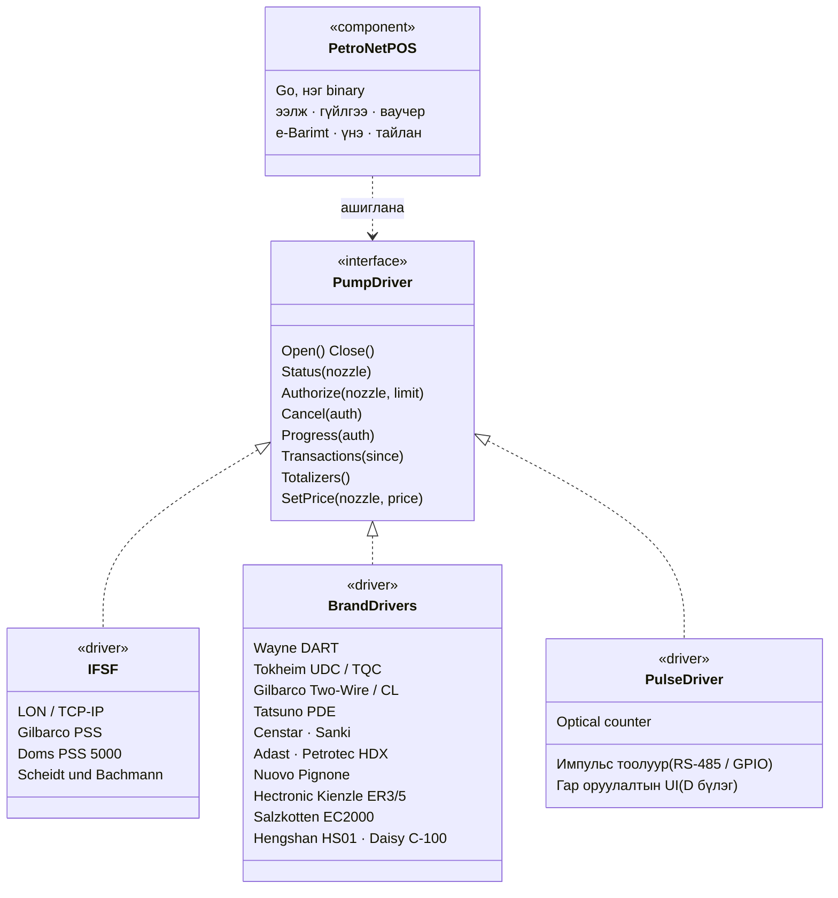

# Төслийн тодорхойлолт

| Зүйл | Утга |
|---|---|
| Дэд төсөл | `petronet-gerege-nexus` → `modules/petro/*` |
| Загварчлалын огноо | 2026-08-17 |
| Загвар | Төр–хувийн түншлэл (ТХТ)-ээр хүргэж, **төрийн хяналтын систем** болж төлөвшинө. Оператор: Gerege Systems. Зохицуулагч: АҮЭБЯ / Шуурхай штаб / ТЕГ / ГЕГ |
| Хэрэглэгчийн таних арга | Гар утасны апп + QR (offline-д тэсвэртэй гарын үсэгтэй код нөөцөөр) |
| Эцсийн төлөв | ШТС бүрийн POS + хошуу бүрийн заалт → төрийн бодит цагийн хяналт (Грек, Турк, Казахстаны загвараар) |


# 0. Товч дүгнэлт (Executive summary)

Өнөөдрийн хямрал бол **нийлүүлэлтийн асуудал төдийгүй мэдээллийн асуудал**. Улсын хэмжээнд хэдэн литр шатахуун хаана байгаа, хэн хэнд, хэзээ хүрэхийг бодит цагт харах ганц эх сурвалж байхгүй учраас: (а) төр нөөцөө таамгаар удирдаж байна, (б) хэрэглэгч сандарч, хэрэгцээгүй үедээ дүүргэж эрэлтийг зохиомлоор 2–3 дахин үрэгдүүлж байна, (в) тэгш/сондгой дугаар, ₮50,000 гэх мэт бүдүүлэг хэрэгсэл л үлдэж байна.

PetroNet нь дараах **дөрвөн** зүйлийг нэг системд нэгтгэнэ:

1. **Молекулын мөрдлөг (chain of custody)** — импортын гэрээ → гаалийн мэдүүлэг → хилийн хүлээн авалт → нөөцийн сав → тээвэр → ШТС-ын сав → түгээгүүрийн хошуу → хэрэглэгч. Литр бүр эх үүсвэрээсээ хошуу хүртэл мөрдөгдөнө.
2. **ШТС-ын POS систем** — өөрийн кассын систем, аль ч үйлдвэрийн түгээгүүр/хошуутай холбогдох **бүх нийтийн адаптерын давхарга** (Gilbarco, Wayne, Tokheim, Tatsuno, Censtar, Sanki, Adast, Petrotec г.м.). Энэ бол өгөгдлийн эх үүсвэр: POS байхгүй бол бодит цагийн хяналт байхгүй.
3. **Ваучерт суурилсан эрэлтийн зохицуулалт** — АИ-92-ыг 1 хүн / 1 тээврийн хэрэгсэлд өдрийн лимиттэйгээр (анхны утга ₮50,000, бодлогоор тохируулагдана) ваучераар олгоно. Ваучер нь **ШТС-д бодит хангалт бүртгэгдсэн тэр агшинд автоматаар үүсч**, хэрэглэгчид **хамгийн ойрын байршлаар** нь санал болгогдоно.
4. **Төрийн хяналтын тогтолцоо** — хошуу бүрийн заалт, сав бүрийн түвшин, гүйлгээ бүрийн баримт төрийн зохицуулагчид бодит цагаар нэгдэнэ. Хямрал өнгөрсний дараа ч үлдэх байнгын дэд бүтэц: татварын хяналт, үнийн хяналт, чанарын хяналт, нөөцийн аюулгүй байдал.

Гол архитектурын шийдэл: **ваучер = нөөцлөгдсөн литр**. Ваучер нь зөвхөн савд бодитоор орсон түлшнээс үүснэ. Ингэснээр амлалт нөөцөөсөө хэзээ ч давахгүй, дараалал алга болно, ШТС хангалтаа мэдээлэхгүй бол ваучер үүсэхгүй тул хэрэглэгчгүй үлдэнэ — **дуулгавартай байдал нь дизайнаараа албадагдана**.

**Стратегийн дараалал:** POS → өгөгдөл → харагдац → ваучер → хяналт. POS-ыг ШТС-д **үнэ төлбөргүй, ашигтай бүтээгдэхүүн** болгож тараах нь төрийн хяналтын системийг барих хамгийн хямд, хамгийн хурдан зам. Албадлагаар биш, үнэ цэнээр нэвтэрнэ.


# 1. Нөхцөл байдлын суурь (2026 оны 8-р сарын байдлаар)

| Үзүүлэлт | Утга | Эх сурвалж |
|---|---|---|
| АИ-92 бензиний нөөц | ~11–15 хоног | Zindaa, Mysteel |
| Дизелийн нөөц | ~20 хоног | Mysteel |
| Сарын импортын зорилт | 75,000 тонн, 3 чиглэлээр | АҮЭБЯ |
| Яаралтай нийлүүлэлт | ОХУ-аас нэмэлт; БНХАУ-аас 6,000 тн АИ-92/95; БНСУ, Казахстан | Moscow Times, Mysteel |
| Хэрэгжсэн хязгаарлалт | 8/3–8/15: тэгш–сондгой дугаар + нэг удаад ₮50,000 | MNB, АҮЭБЯ |
| Хязгаарлалтын төлөв | 8/15-наас цуцлагдсан (түр) | АҮЭБЯ, urug.mn |

**Дүгнэлт:** хязгаарлалтыг цуцалсан ч бүтцийн эмзэг байдал арилаагүй. Дараагийн давалгаа ирэхэд гар аргаар биш, **систем бэлэн** байх ёстой. PetroNet-ийг "хямралын үед асдаг, тайван үед хяналтын систем болж ажилладаг" гэсэн хоёр горимтой зохионо.


# 2. Зорилго ба амжилтын хэмжүүр

| # | Зорилго | Хэмжүүр (KPI) | Зорилтот утга |
|---|---|---|---|
| G1 | Улсын нөөцийн бодит цагийн харагдац | Мэдээллийн саатал (data latency) | < 15 мин, ШТС-ын 90%-д |
| G2 | Дарааллыг арилгах | ШТС дээрх дундаж хүлээлт | < 7 мин |
| G3 | Шударга хуваарилалт | Ваучер авсан өрхийн хувь / бүсээр Gini коэффициент | Gini < 0.15 |
| G4 | Хиймэл эрэлтийг таслах | Нэг тээврийн хэрэгслийн 7 хоногийн давтамж | ≤ 3 удаа |
| G5 | Алдагдал / зүй бус зарцуулалтыг илрүүлэх | Reconciliation зөрүү (импорт vs түгээлт) | < 0.5% |
| G6 | Бодлогын хурд | Лимит/квотын өөрчлөлт хүчин төгөлдөр болох хугацаа | < 5 мин, кодгүйгээр |
| G7 | Тэсвэр | Оргил ачаалалд амжилттай хүсэлтийн хувь | > 99.5% |


# 3. Хамрах хүрээ — бүтэн гинжин хэлхээ

Хэрэглэгч нь "импортлогчийн захиалга, гаалийн бүртгэл, нөөцийн сав, тээвэр, түгээгүүр" гэж дурдсан. Доор тэдгээрийг бүрэн болгож, **дутууг нөхлөө** (★ тэмдэгтэй нь миний нэмсэн зангилаа).



## 3.1 Зангилаа тус бүрийн бүртгэх өгөгдөл

| # | Зангилаа | Гол өгөгдөл | Эх сурвалж / төхөөрөмж |
|---|---|---|---|
| 1 | Импортын гэрээ/захиалга | Импортлогч, нийлүүлэгч, төрөл, тонн, Incoterms, үнэ, валют, төлбөрийн нөхцөл, хүлээгдэж буй огноо | Импортлогчийн портал / API |
| 2 | Ачилт | Вагоны дугаар, партийн дугаар (batch), ачсан хэмжээ, гарал үүсэл | Нийлүүлэгчийн баримт, RailData |
| 3 | Гааль | Мэдүүлгийн дугаар, HS код, гаалийн үнэ, ОАТ/НӨАТ, чөлөөлөлт, гарц (Сүхбаатар/Замын-Үүд/Алтанбулаг/Боршоо) | ★Гаалийн ерөнхий газрын API |
| 4 | ★Чанар | Октаны тоо, нягт, хүхэр, ус, лабораторийн дугаар, партийн гэрчилгээ | Итгэмжлэгдсэн лаборатори |
| 5 | Нөөцийн сав | Терминал, савны №, багтаамж, түвшин, температур, чөлөөт багтаамж | ATG (Veeder-Root/Start-Italiana г.м.) |
| 6 | ★Стратегийн нөөц | Улсын нөөцөд шилжсэн хэмжээ, гаргах зөвшөөрлийн шийдвэр | Улсын нөөцийн газар |
| 7 | ★Хэмжил зүй | Ажиглалтын литр, температур, нягт → **15°C-т шилжүүлсэн литр** | Стандарт хэмжил зүйн газар |
| 8 | Тээврийн даалгавар | Автоцистерн, жолооч, гарсан хэмжээ, ачсан сав, очих ШТС, ETA | Тээвэрлэгчийн модуль |
| 9 | ★GPS + лац | Замын траектор, зөрсөн зогсолт, цахим лацны төлөв | Телематик, e-seal |
| 10 | ШТС хүлээн авалт | Хүлээн авсан литр, савны түвшний өсөлт, зөрүү, хүлээн авсан ажилтан | ATG + гар баталгаажуулалт |
| 11 | ШТС-ын сав | Төрөл бүрийн үлдэгдэл, ус, өдрийн хэрэглээ, дуусах прогноз | ATG poll (5 мин тутам) |
| 12 | Түгээгүүр/хошуу | Тоолуурын нийт заалт (totalizer), гүйлгээ бүрийн литр/дүн, хошууны төрөл | Forecourt controller (IFSF/PSS) |
| 13 | ★Ээлж | Ээлж нээх/хаах заалт, кассын тулгалт, ажилтан | ШТС-ын POS |
| 14 | Ваучер | Эрх, лимит, нөөцлөлт, хугацаа, redeem, цуцлалт | PetroNet цөм |
| 15 | Хэрэглэгч | Иргэн, тээврийн хэрэгсэл, эрхийн ангилал, түүх | ★ХУР / e-Mongolia |
| 16 | ★e-Barimt | Баримтын дугаар, НӨАТ, буцаан олголт | ТЕГ e-Barimt |
| 17 | ★Нөхцөлдүүлэлт | Импорт − нөөц − түгээлт = 0 ± зөвшөөрөгдөх алдаа | PetroNet insight |

## 3.2 Бүтээгдэхүүний хамрах хүрээ

Зөвхөн АИ-92 биш. Нэг өгөгдлийн загвараар:
АИ-80, **АИ-92**, АИ-95, Дизель (зун/өвөл/арктик), ТС-1 нисэхийн түлш, шингэрүүлсэн шатдаг хий (LPG), мазут, тос тосолгооны материал.

Лимит/ваучер зөвхөн **бодлогоор идэвхжүүлсэн** бүтээгдэхүүнд үйлчилнэ (эхлээд АИ-92; шаардлагатай бол дизель).


# 4. Ваучерийн систем — гол механизм

## 4.1 Үндсэн зарчим

> **Ваучер бол амлалт биш, нөөцлөгдсөн литр.**

Ваучер зөвхөн ШТС-ын савд **бодитоор орсон** түлшнээс үүснэ. Ингэснээр систем хэзээ ч биелүүлж чадахгүй амлалт өгөхгүй.

## 4.2 Автомат үүсэлтийн гинж



Тооцооллын томьёо (3, 4-р алхам):

```
боломжит_литр  = хүлээн_авсан
               − аль_хэдийн_нөөцлөгдсөн_ваучерийн_литр
               − техникийн_үлдэгдэл (dead stock)
               − тэргүүлэх_ангиллын_нөөц (%)

ваучерийн_литр = лимит_дүн (₮50,000) ÷ тухайн_үеийн_үнэ
слотын_тоо     = боломжит_литр ÷ ваучерийн_литр
```

**Дуулгавартай байдлын хөшүүрэг:** хангалтаа бүртгүүлээгүй ШТС-д ваучер үүсэхгүй → хэрэглэгч очихгүй → мэдээлэхээс өөр сонголтгүй. Хяналтыг шалгагчаар биш, урамшуулалаар шийдэж байгаа нь энэ дизайны хамгийн үнэ цэнэтэй тал.

## 4.3 Эрхийн дүрэм (Entitlement)

| Хэмжигдэхүүн | Анхны утга | Тохируулга |
|---|---|---|
| Нэгж эрх | 1 иргэн (РД) × 1 тээврийн хэрэгсэл (улсын дугаар) | Бодлого |
| Нэг удаагийн лимит | ₮50,000 | Дүн эсвэл литрээр |
| Давтамж | 24 цагт 1 удаа | Цаг/өдөр/7 хоног |
| 7 хоногийн дээд хязгаар | ₮150,000 | Бодлого |
| Хүчинтэй хугацаа | 6 цаг | 1–48 цаг |
| Бүс | Аймаг/дүүрэг | Геозайгаар |

**Тэргүүлэх ангилал** (тусдаа квоттой, дарааллаас гадуур):
- Түргэн тусламж, галын алба, цагдаа, онцгой байдал
- Нийтийн тээвэр, сургуулийн автобус
- Ачаа тээвэр — хүнс, эм, түлш
- Улирлын: ХАА-н ургац хураалт, отор, өвөлжилт
- Уул уурхайн гэрээт хэрэглэгч (тусдаа B2B суваг, ваучерийн пулаас гадуур)

**Тээврийн хэрэгслийн ангиллаар литрийн коэффициент** (сонголт):
суудлын 1.0× · микроавтобус 1.5× · ачааны 2.5× · автобус 4.0×
Ингэснээр ₮50,000 нь Prius болон 20 тонны ачааны машинд ижил утгагүй байх асуудал шийдэгдэнэ.

## 4.4 Хуваарилалтын алгоритм (Allocation)

Слотыг хэнд өгөхийг дараах **жинлэсэн оноогоор** шийднэ:

```
оноо = w1 · ойролцоо_байдал(хэрэглэгч, ШТС)
     + w2 · хүлээсэн_хугацаа (сүүлд ваучер авснаас хойш)
     + w3 · тэргүүлэх_ангилал
     + w4 · бүсийн_хангамжийн_дутагдал (тухайн хүн амьдардаг бүс хомс бол)
     − w5 · сүүлийн_үеийн_хэрэглээ (7 хоногт хэт олон авсан бол)
```

**Ойролцоо байдал:** хэрэглэгчийн бүртгэлтэй хаяг эсвэл сүүлийн мэдэгдсэн байршил (аппын GPS, зөвшөөрөлтэй). H3 геоиндексээр (resolution 7 ≈ 5 км) эрэмбэлнэ.

**Сандралын эсрэг (anti-panic):** бүх мэдэгдлийг нэг дор биш, **шатлан** (staggered) 30–120 секундын зайтай илгээнэ. Sri Lanka-гийн 2026 оны уналт нь яг үүнээс — "түгшүүртэй хэрэглэгчийн үржүүлэгч" (anxious user multiplier)-ийг тооцоогүйгээс болсон.

**Мухардлаас сэргийлэх (anti-starvation):** 48 цаг ваучер аваагүй хэрэглэгч автоматаар хамгийн дээд эрэмбэд гарна.

## 4.5 Ваучерийн төлөвийн машин



Бүх шилжилт **идемпотент** (idempotency key-тэй). Давхар дарсан товч, сүлжээ тасарсан retry нь хоёр ваучер үүсгэхгүй.

## 4.6 QR ба офлайн баталгаажуулалт

QR дотор задлагдсан агуулга (JSON биш, компакт CBOR + Ed25519 гарын үсэг, ~180 байт):

```
{
  v:  1,                      // хувилбар
  id: <ULID>,                 // ваучерийн ID
  s:  <станцын ID>,           // зөвхөн энэ ШТС-д
  p:  92,                     // бүтээгдэхүүн
  l:  2380,                   // дээд литр (centi-litre)
  a:  50000,                  // дээд дүн (₮)
  nb: <эхлэх unix ts>,        // хүчинтэй эхлэх
  na: <дуусах unix ts>,       // хүчинтэй дуусах
  h:  <тээврийн хэрэгслийн дугаарын хэш, 6 байт>,
  n:  <nonce>
}  + sig(Ed25519, 64 байт)
```

**Офлайн горим:** ШТС-ын терминал сервертэй холбогдож чадахгүй үед PetroNet-ийн нийтийн түлхүүрээр гарын үсгийг **локал** шалгана. Ашигласан ваучерийн ID-г локал bloom filter + жагсаалтад хадгална (давхар ашиглалтаас сэргийлнэ), холбогдмогц sync хийнэ.

**Эрсдэл:** офлайн үед хоёр өөр ШТС дээр нэг ваучер ашиглах онолын боломж. Шийдэл — QR нь **тодорхой нэг ШТС-д** уягдсан (`s` талбар). Өөр станцад хүчингүй.

**Нөөц суваг** (аппгүй хэрэглэгчид):
- SMS-ээр 8 оронтой богино код (HMAC-аар үүсгэсэн, Луны тоогоор шалгах цифртэй)
- USSD цэс (\*XXXX#) — интернэтгүй хөдөө орон нутагт
- ШТС-ын оператор улсын дугаар + РД-ээр гар аргаар хайх (аудит бүртгэлтэй)

## 4.7 Залилангийн эсрэг (Anti-fraud)

| Эрсдэл | Илрүүлэлт | Хариу арга хэмжээ |
|---|---|---|
| Савтай/канистртай худалдан авалт | Түгээлтийн хугацаа/урсгалын профиль (машины бак 30–40 л/мин, канистр богино тасалдалтай) | Дохиолол, ШТС-ын камерын шалгалт |
| Нэг машин олон РД-ээр | Улсын дугаарын хэш давтамж | 24 цагт 1 машин 1 удаа — хатуу |
| Нэг хүн олон машин | ХУР-аас эзэмшлийн шалгалт | Эзэмшигчээр 1 идэвхтэй эрх |
| Хуурамч тээврийн хэрэгсэл | ХУР-ын бүртгэл + техникийн үзлэгийн төлөв | Идэвхгүй ТХ-д эрх олгохгүй |
| ШТС-ын ажилтны залилан | Redeem хийсэн ваучер vs түгээгүүрийн бодит заалтын зөрүү | Ажилтны түвшний скор, ээлжийн тулгалт |
| Хилээр гарах контрабанд | Хилийн бүсийн ШТС-ын хэвийн бус хэрэглээ, дугаарын бүртгэл | Хилийн 50 км бүсэд тусдаа лимит |
| Тээвэрлэлтийн хулгай | GPS зөрсөн зогсолт + ачсан/хүлээн авсан зөрүү | Автомат тасалбар (case) үүснэ |
| SIM/данс шилжүүлэлт | Утасны дугаар солигдох давтамж | Дугаар солиход 24 цагийн хөргөлт |

**Гол сургамж (Sri Lanka):** үндсэн танигчаар **утасны дугаарыг сонгож болохгүй** — дугаар дахин ашиглагддаг. Танигч нь **тээврийн хэрэгслийн VIN/арлын дугаар + эзэмшигчийн РД**.


# 5. Архитектур

## 5.1 Экосистемийн байрлал

Энэ репогийн дүрэм тодорхой: **импортлож чадах кодыг хуулахгүй**. Одоо байгаа дөрвөн модулийг хэвээр ашиглана:

| Одоо байгаа (Business) | PetroNet-д хэрхэн үйлчлэх |
|---|---|
| `contacts` | Импортлогч, тээвэрлэгч, ШТС эзэмшигч, хэрэглэгч |
| `products` | АИ-92/95/80, дизель, LPG — SKU, шинж чанар |
| `inventory` | Сав, нөөц, хөдөлгөөн (сөрөг үлдэгдэл хориотой — `inventory.New(p, false)`) |
| `billing` | Нэхэмжлэх, e-Barimt, төлбөр |

**Шинээр бичих нь зөвхөн шатахууны станцад л байдаг зүйл** — main.go-д бичсэнчлэн "pumps, nozzles, shift readings". Тэдгээр нь **энэ репо доторх модуль** болно:

```
petronet-gerege-nexus/
├── main.go                    ← modules/petro/* нэмж бүртгэнэ
├── catalog/apps.json          ← PetroNet аппуудын каталог (шинэ)
├── catalog_test.go            ← хэвээр, шинэ модулиудыг нэмнэ
├── db/petro/                ← миграц (goose_db_version_petro)
└── modules/
    ├── forecourt/             ← ШТС, түгээгүүр, хошуу, ээлж, тоолуур
    ├── pos/                   ← ★кассын систем: гүйлгээ, төлбөр, ээлж, офлайн
    ├── pump/                  ← ★хошууны драйверын интерфейс + брэндийн драйверууд
    │   ├── ifsf/  gilbarco/  wayne/  tokheim/  tatsuno/  censtar/  pulse/
    ├── depot/                 ← нөөцийн сав, ATG, хэмжил зүй, температур
    ├── tank/                  ← ★ATG драйверууд (Veeder-Root, Start, Modbus…)
    ├── supply/                ← импорт, гааль, партия, чанар
    ├── logistics/             ← тээврийн даалгавар, GPS, цахим лац
    ├── voucher/               ← эрх, лимит, ваучер, redemption
    ├── allocation/            ← хуваарилах хөдөлгүүр, бодлогын engine
    ├── identity/              ← ХУР/e-Mongolia холбоос, ТХ-эзэмшигч
    ├── oversight/             ← ★төрийн хяналт: hash chain, аудит, зохицуулагчийн эрх
    └── insight/               ← reconciliation, прогноз, дохиолол, ил тод байдал

edge/                          ← ★ирмэгийн агент (тусдаа binary, ШТС дээр ажиллана)
    ├── cmd/petro-edge/       локал SQLite, офлайн дараалал, sync
    └── driver/                 pump ба tank драйверуудыг ачаална
```

**Ирмэгийн агент (`edge/`) нь тусдаа binary** — ШТС дээрх жижиг Linux төхөөрөмж эсвэл Android таблет дээр ажиллана. Сервертэй gRPC/MQTT-ээр ярина, тасарвал локал SQLite-д хуримтлуулж, холбогдмогц идемпотентоор нөхнө. POS-ын UI нь энэ агент дээрх локал вэб сервер (PWA) — интернэт байхгүй ч ажиллана.

Модуль тус бүр цөмийн `nexus.Platform`-д `New(p)`-ээр бүртгэгдэж, өөрийн миграц, каталогийн бичилт, RBAC-ийн эрхтэй байна.

## 5.2 Байршуулалтын топологи



**Sri Lanka-гийн уналтаас авах 5 дүрэм** (энэ дизайнд шингээсэн):

1. **Гадаад системийг синхроноор дуудахгүй.** ХУР-ын шалгалт нь дараалалд орж, SMS-ээр хариу мэдэгдэнэ. Хэрэглэгч хүлээхгүй.
2. **Идемпотент байх.** Хүсэлт бүр `Idempotency-Key`-тэй. Давхардсан хүсэлт нэг үр дүн буцаана.
3. **Circuit breaker + rate limit.** ХУР унавал PetroNet унахгүй — сүүлд амжилттай шалгасан кэшээр (24 цагийн TTL) үргэлжилнэ.
4. **Өгөгдлийг цэвэрлэж эхлэх.** Хуучин бүртгэлийг шууд дахин ашиглахгүй. Эзэмшил солигдсон ТХ, дахин олгогдсон утасны дугаарыг эхлэхээс өмнө нөхцөлдүүлнэ.
5. **Үе шаттай нэвтрүүлэлт.** Улс даяар нэг дор биш — аймгаар, дүүргээр.

## 5.3 Ачааллын тооцоо

| Үзүүлэлт | Тооцоо |
|---|---|
| Бүртгэлтэй тээврийн хэрэгсэл (МУ) | ~1.3 сая |
| Идэвхтэй хэрэглэгч (зорилт) | ~700 мянга |
| ШТС (МУ) | ~800–900 |
| Өдрийн гүйлгээ (хямралын үед) | ~250–350 мянга |
| Оргил TPS (өглөө 07:00–09:00) | ~120 үндсэн, **сандралын үед 3,000+ унших** |
| ATG poll | 900 ШТС × 4 сав × 12/цаг = ~43 мянга/цаг |
| QR шалгалт | ~350 мянга/өдөр |

Унших ачааллыг read replica + Redis-ээр таслана. Бичих ачаалал бага (гүйлгээний тоо цөөн) тул нэг primary хангалттай.


# 6. ШТС-ын POS систем ба хошууны интеграц

> Энэ бол платформын **суурь**. Хошууны заалт байхгүй бол нөөц бодит биш, ваучер баталгаагүй, хяналт таамаг болно.

## 6.1 Яагаад өөрийн POS вэ

Монголын ШТС-ууд өнөөдөр 4 янзын байдалтай:

| Төлөв | Ойролцоо эзлэх хувь* | PetroNet-ийн хандлага |
|---|---|---|
| A. Орчин үеийн POS + forecourt controller-тэй (том сүлжээ) | ~20% | **Интеграц** — POS-ыг нь хэвээр үлдээж, API-аар өгөгдөл авна |
| B. Хуучин POS, controller-тэй ч хаалттай | ~25% | **Гүүр** — controller-т зэрэгцээ (tap) холбогдоно, эсвэл POS-ыг солино |
| C. Түгээгүүр цахим, гэхдээ зөвхөн гараар бичдэг | ~35% | **PetroNet POS суулгана** — гол зорилтот бүлэг |
| D. Механик/маш хуучин түгээгүүр, интернэтгүй | ~20% | **Хөнгөн POS + импульс тоолуур**, офлайн горим |

\* Фаз 0-ийн аудитаар баталгаажна. Одоогийн таамаг.

C ба D нь ШТС-ын **талаас илүү хувь** — тэдэнд зориулсан бүтээгдэхүүнгүйгээр улсын хэмжээний хяналт боломжгүй. Тиймээс PetroNet өөрийн POS-той байх ёстой.

## 6.2 Бүх нийтийн хошууны адаптер (Universal Pump Adapter)

Гол дизайны шийдэл: **драйверын архитектур**. Цөм нь ганц дотоод интерфейстэй, брэнд бүр драйвер болно.



**`pump.Driver` интерфейс (Go):**

```go
package pump

// Driver — түгээгүүрийн аль ч брэнд, аль ч протоколыг нэг хэлбэрт оруулна.
// Шинэ брэнд нэмэх нь энэ интерфейсийг хэрэгжүүлэх нэг файл — цөм өөрчлөгдөхгүй.
type Driver interface {
	Open(ctx context.Context, cfg Config) error
	Close() error

	// Төлөв — сул / эрх хүлээж буй / түгээж буй / дууссан / алдаатай
	Status(ctx context.Context, n NozzleID) (Status, error)

	// Эрх олгох. Ваучерийн лимитийг тоо хэмжээ эсвэл дүнгээр хатуу тавина.
	Authorize(ctx context.Context, n NozzleID, limit Limit) (AuthID, error)
	Cancel(ctx context.Context, a AuthID) error

	// Явцын урсгал — дүрслэлд ба залилан илрүүлэлтэд
	Progress(ctx context.Context, a AuthID) (<-chan Delivery, error)

	// Дууссан гүйлгээ. POS унасан ч дараа нь эндээс сэргээж болно.
	Transactions(ctx context.Context, since Seq) ([]Transaction, error)

	// Тоолуурын нийт заалт — ээлжийн тулгалт ба reconciliation-ийн үндэс
	Totalizers(ctx context.Context) (map[NozzleID]Totalizer, error)

	// Үнийн самбар / хошууны үнийг алсаас солих (боломжтой бол)
	SetPrice(ctx context.Context, n NozzleID, p Money) error
}
```

**Хэрэгжүүлэлтийн дараалал:**

| Ээлж | Драйвер | Шалтгаан |
|---|---|---|
| 1 | **IFSF (LON + TCP/IP)** | Олон улсын стандарт; орчин үеийн controller-ууд дэмждэг. Нэг драйвераар олон брэнд |
| 2 | **Импульс/тоолуур + гар оруулалт** | D бүлгийн ШТС-ыг хамруулна — хамгийн олон, хамгийн хэрэгцээтэй |
| 3 | **Gilbarco Two-Wire / CL**, **Wayne DART** | Монголд түгээмэл |
| 4 | **Tokheim UDC/TQC**, **Tatsuno PDE** | Түгээмэл |
| 5 | Хятадын үйлдвэрлэл (Censtar, Sanki, Zcheng, Tokico) | Сүүлийн жилүүдэд шинээр суурилуулагдсан |
| 6 | Бусад (Adast, Petrotec, Hectronic, Salzkotten, Nuovo Pignone) | Ховор, захиалгаар |

**Хэрэглэгддэг физик давхарга:** RS-485 / RS-422 / RS-232 / Current loop / LON / Ethernet. PetroNet-ийн **ирмэгийн төхөөрөмж** (edge box — жижиг Linux SBC) нь эдгээрийг USB-serial болон LON интерфейсээр авч, MQTT/gRPC-ээр сервер рүү илгээнэ.

> **Хууль зүйн анхаарал:** зарим протокол нь үйлдвэрлэгчийн өмч, NDA/лицензтэй (Gilbarco Two-Wire, Wayne DART). Хоёр зам: (а) үйлдвэрлэгч/дистрибьютертэй лиценз гэрээ байгуулах, (б) IFSF-д хөрвүүлдэг гуравдагч этгээдийн gateway (жишээ нь Doms PSS 5000, эсвэл бэлэн pump interface box) ашиглах. Фаз 0-д хууль зүйн шалгалт заавал.

## 6.3 ATG (савны хэмжигч) драйверууд

Ижил зарчмаар `tank.Driver`:

| Брэнд / протокол | Тэмдэглэл |
|---|---|
| Veeder-Root TLS-350 / TLS-450 (Serial + TCP) | Дэлхийд хамгийн түгээмэл |
| Start Italiana SMT / Sensor | Европ |
| Franklin Fueling (INCON) TS-5 | |
| OPW SiteSentinel | |
| Modbus RTU/TCP (ерөнхий) | Хятад, дотоодын хэмжигч |
| **Гар хэмжилт (метршток)** | ATG-гүй ШТС-д ээлж тутам заавал оруулах |

## 6.4 PetroNet POS-ын чадамж

**Түлшний хэсэг**
- Хошуу бүрийн бодит цагийн төлөв, эрх олгох/цуцлах
- Урьдчилсан төлбөр (prepay) / дараа төлбөр (postpay) / бүрэн бак
- Ваучер уншиж, лимитийг **түгээгүүрт хатуу тавих** (кассын мэдэглэлээр биш)
- Ээлж нээх/хаах, тоолуурын заалт, кассын тулгалт, зөрүүний тайлбар
- Савны үлдэгдэл, ус, дуусах прогноз, хүлээн авалт
- Үнийн өөрчлөлт — төвөөс алсаар, түүхтэй (үнийн хяналтын үндэс)

**Худалдааны хэсэг** (Business модулиудаар — шинээр бичихгүй)
- Дэлгүүр, кофе, угаалга, тос — `products` + `inventory` + `billing`
- Нэхэмжлэх, e-Barimt, НӨАТ

**Төлбөр**
- Бэлэн, банкны карт, QPay, банкны апп, корпоратив карт/гэрээт хэрэглэгч, ваучер

**Ажиллагааны шинж**
- **Офлайн эхлэл (offline-first)** — интернэтгүй 72 цаг бүрэн ажиллана, локал SQLite, холбогдмогц sync
- **Хямд төхөөрөмж** — Android таблет эсвэл ямар ч x86 миникомпьютер; тусгай төхөөрөмж шаардахгүй
- **Монгол хэл**, том товч, бээлийтэй ажиллах UI (−30°C-т)
- **Тамга нь эвдэрсэн нь мэдэгдэх (tamper-evident)** — бүх гүйлгээ hash-chain-д холбогдоно (доорх 7.3)

## 6.5 ШТС-ын хувьд ямар ашигтай вэ (нэвтрэлтийн хөшүүрэг)

Албадлага ганцаараа ажиллахгүй. POS нь ШТС-д **бодит ашиг** өгөх ёстой:

1. Ваучерийн урсгал → хэрэглэгч (хямралын үед хамгийн том хөшүүрэг)
2. Ээлжийн тулгалт автомат → ажилчны хулгай багасна (ихэвчлэн 0.3–1% эргэлт)
3. Савны дуусах прогноз → хоосон зогсох цаг багасна
4. e-Barimt автомат → нягтлан бодох цаг хэмнэнэ
5. Үнэ төлбөргүй (эсвэл хамгийн бага) — төрийн дэмжлэг/ТХТ-ийн санхүүжилтээр
6. Олон салбарын нэгдсэн тайлан → сүлжээний эздэд


# 7. Төрийн хяналтын тогтолцоо

> Хямрал өнгөрнө. Хяналтын систем үлдэнэ. PetroNet-ийг эхнээс нь **байнгын төрийн дэд бүтэц** болгож зохионо.

## 7.1 Дэлхийн загварууд

| Улс | Систем | Юуг албадсан |
|---|---|---|
| **Грек** | AADE Fuel Input–Output System (ЖСТ A.1176/2024) | ШТС бүр **орлого–гарлын** цахим систем суулгаж, савны хэмжилт ба түгээгүүрийн гүйлгээг татварын албанд шууд дамжуулна. 2026 оны 9/30 (Афин, Тесалоник), 12/31 (бусад) — бүрэн хэрэгжинэ |
| **Турк** | Түгээгүүрт холбогдсон фискал төхөөрөмж (ÖKC) + **UTTS** (тээврийн хэрэгслийн үндэсний таних систем) | Хошуу бүр фискал төхөөрөмжид холбогдоно; тээврийн хэрэгсэл RFID-ээр танигдана |
| **Казахстан** | Мэдээллийн систем + виртуал агуулах | Түлшний хөдөлгөөн бүрийг цахимаар мэдүүлэх |
| **Бразил** | ANP SIMP | Зохицуулагчид стандарт форматаар заавал тайлагнах |
| **Боливи** | B-SISA | Улсын дугаар + биометрээр хилийн контрабанд таслах |
| **Иран** | Fuel smart card | Хошуу–карт шууд холбоос, квот, хоёр түвшний үнэ |

**Монголд авах загвар:** Грекийн "орлого–гарлын систем" + Туркийн "хошуунд холбогдсон фискал төхөөрөмж" + Малайзын "эрхэд суурилсан татаас". Гурвыг нэг платформд.

## 7.2 Хяналтын дөрвөн зорилт

| # | Зорилт | Хэрхэн хэрэгжих |
|---|---|---|
| **К1** | **Нөөцийн аюулгүй байдал** | Улсын нөөцийн бодит цагийн зураг; аймаг тус бүрийн хоногийн нөөц; хямралын эрт сэрэмжлүүлэг |
| **К2** | **Татварын хяналт** | Хошуунаас гарсан литр = e-Barimt-аар бүртгэгдсэн литр. Зөрүү = НӨАТ/ОАТ-ын алдагдал. ΔD баланс |
| **К3** | **Үнийн хяналт** | Үнийн өөрчлөлт бүр төвд бүртгэгдэнэ; тогтоосон дээд үнэ давсныг автоматаар илрүүлнэ; татаасын зөв зарцуулалт |
| **К4** | **Чанарын хяналт** | Партийн лабораторийн гэрчилгээ хошуу хүртэл мөрдөгдөнө. Октаны тоо худал зарласан партийг гарал үүслээр нь олно |

## 7.3 Өгөгдлийн бүрэн бүтэн байдал (tamper evidence)

Төрийн хяналтын систем болохын гол нөхцөл нь **өгөгдлийг дараа нь засах боломжгүй** байх.

- ШТС бүрийн гүйлгээ **hash chain**-д холбогдоно: `H(n) = SHA256(H(n−1) ‖ гүйлгээ(n))`
- POS нь өөрийн төхөөрөмжийн түлхүүрээр (secure element эсвэл програм хангамжийн keystore) гарын үсэг зурна
- Сервер нь өдөр бүр гинжний үзүүрийг **баталгаажуулагч тэмдэглэлд** (append-only, WORM хадгалалт) бичнэ
- Дугаарлалтын завсар (gap) = дохиолол. Офлайн үед ч дараалал тасрахгүй, дараа sync хийхэд илрэнэ
- Тоолуурын нийт заалт (totalizer) хэзээ ч буурч болохгүй — буурсан нь **төхөөрөмжид гар хүрсэн** тодорхой шинж
- Пломбын бүртгэл: түгээгүүрийн хэмжлийн блок, POS-ын холболт — хэмжил зүйн байгууллагын лац

## 7.4 Эрх зүйн суурь (шаардлагатай баримт бичиг)

| # | Баримт | Агуулга | Хариуцагч |
|---|---|---|---|
| 1 | Засгийн газрын тогтоол | ШТС-д цахим орлого–гарлын систем суулгах шаардлага, хугацаа | ЗГ / АҮЭБЯ |
| 2 | Техникийн журам | Өгөгдлийн формат, дамжуулах давтамж, tamper-evidence шаардлага, гэрчилгээжүүлэлт | АҮЭБЯ + Стандартчиллын газар |
| 3 | Ваучерийн журам | Эрх, лимит, тэргүүлэх ангилал, гомдол барагдуулах | ЗГ / Шуурхай штаб |
| 4 | Мэдээлэл солилцооны гэрээ | ХУР, ГЕГ, ТЕГ-тэй | Оператор + агентлагууд |
| 5 | Хувийн мэдээллийн нөлөөллийн үнэлгээ (DPIA) | РД, байршил, тээврийн хэрэгслийн өгөгдөл | Оператор |
| 6 | POS-ын гэрчилгээжүүлэлтийн журам | Аль POS системүүд стандартад нийцэж байгааг батлах — **зөвхөн PetroNet биш**, өрсөлдөөнийг нээлттэй байлгах | Стандартчиллын газар |

> **№6 чухал:** төрийн хяналтын систем нь нэг нийлүүлэгчид түгжигдэх ёсгүй. PetroNet нь **стандартыг** тодорхойлж, лавлагаа хэрэгжүүлэлт (reference implementation) болно. Бусад POS үйлдвэрлэгч ижил API-д нийцвэл гэрчилгээжинэ. Энэ нь улс төрийн эсэргүүцлийг мэдэгдэхүйц бууруулна.

## 7.5 Зохицуулагчийн эрх, түвшин

| Түвшин | Хэн | Юу харах | Юу хийх |
|---|---|---|---|
| L1 | Иргэн | Нийтийн ил тод байдлын хуудас | — |
| L2 | ШТС-ын оператор | Өөрийн салбар | Ээлж, гүйлгээ |
| L3 | Сүлжээний менежер | Өөрийн бүх салбар | Үнэ, хангалт |
| L4 | Импортлогч / тээвэрлэгч | Өөрийн партия, тээвэр | Мэдүүлэг |
| L5 | Аймгийн ЗДТГ | Тухайн аймгийн бүх ШТС | Орон нутгийн квот |
| L6 | АҮЭБЯ / Шуурхай штаб | Улс даяар | **Бодлого, лимит, квот** |
| L7 | ТЕГ (татвар) | Гүйлгээ, e-Barimt, ΔD | Шалгалт эхлүүлэх |
| L8 | ГЕГ (гааль) | Импорт, мэдүүлэг, ΔA | Шалгалт эхлүүлэх |
| L9 | Аудитор | Бүх зүйл, зөвхөн унших | Гинжний баталгаажуулалт |

Бүх хандалт бүртгэгдэнэ. L6–L9 түвшний хандалт нь **хоёр хүний баталгаажуулалт** (dual control) шаардана.

## 7.6 Хямрал → энгийн үеийн шилжилт

PetroNet хоёр горимтой, шилжилт нь бодлогын нэг тохиргоо:

| | **Хямралын горим** | **Энгийн горим** |
|---|---|---|
| Ваучер | Заавал | Идэвхгүй (эсвэл зөвхөн татаастай ангилалд) |
| Лимит | Хатуу (₮50,000/өдөр) | Байхгүй |
| Хуваарилалт | Төвөөс, ойролцоо байдлаар | Зах зээлээр |
| POS өгөгдөл | Бодит цагаар | Бодит цагаар (**өөрчлөгдөхгүй**) |
| Reconciliation | Өдөр бүр | Өдөр бүр (**өөрчлөгдөхгүй**) |
| Ил тод байдал | Бүрэн | Бүрэн (**өөрчлөгдөхгүй**) |

Өөрөөр хэлбэл **хяналтын давхарга хэзээ ч унтардаггүй**; зөвхөн эрэлтийг хуваарилах давхарга л асаж унтарна. Энэ нь дараагийн хямралд систем 5 минутын дотор бэлэн байхын баталгаа.


# 8. Өгөгдлийн загварын үндсэн хүснэгтүүд

```sql
-- ХУВААРИЛАЛТ
petro_entitlement        (id, citizen_rd_hash, vehicle_id, product, tier,
                            daily_cap_mnt, weekly_cap_mnt, zone_id, status, ...)
petro_voucher            (id ULID, entitlement_id, station_id, product,
                            max_litres, max_amount_mnt, state, not_before,
                            not_after, issued_at, reserved_at, dispensed_at,
                            dispensed_litres, dispensed_amount, sig, ...)
petro_voucher_event      (id, voucher_id, from_state, to_state, actor,
                            idempotency_key, occurred_at, payload jsonb)
petro_allocation_round   (id, station_id, replenishment_id, available_litres,
                            slot_count, policy_version, created_at)

-- ХАНГАМЖ
petro_import_order       (id, importer_id, supplier, product, tonnes,
                            incoterm, currency, price, eta, status)
petro_customs_entry      (id, import_order_id, declaration_no, hs_code,
                            border_post, cleared_at, duties_mnt, litres_15c)
petro_batch              (id, customs_entry_id, lab_cert_no, octane,
                            density, sulphur_ppm, approved bool)
petro_tank               (id, site_id, site_type, product, capacity_l,
                            dead_stock_l, atg_device_id)
petro_tank_reading       (tank_id, ts, level_mm, volume_l, volume_15c_l,
                            temperature_c, water_mm)          -- hypertable
petro_movement           (id, from_tank, to_tank, batch_id, litres,
                            litres_15c, kind, occurred_at)

-- ЛОГИСТИК
petro_dispatch           (id, truck_id, driver_id, from_depot, to_station,
                            loaded_l, loaded_15c_l, seal_no, departed_at,
                            arrived_at, received_l, variance_pct, status)
petro_gps_track          (dispatch_id, ts, lat, lon, speed, ignition)  -- hypertable

-- ШТС ба POS
petro_station            (id, operator_id, name, lat, lon, zone_id, h3_r7,
                            aimag, soum, status, is_border_zone bool,
                            integration_class char)      -- A/B/C/D (6.1)
petro_edge_device        (id, station_id, serial, pubkey, agent_version,
                            last_seen_at, last_seq bigint, status)
petro_pump               (id, station_id, code, brand, driver, transport,
                            address, sealed_at, seal_no)
petro_nozzle             (id, pump_id, code, product, totalizer_l,
                            totalizer_read_at)
petro_shift              (id, station_id, opened_at, closed_at, staff_id,
                            open_totalizers jsonb, close_totalizers jsonb,
                            cash_declared, cash_expected, variance_mnt)
petro_dispense           (id, station_id, nozzle_id, shift_id, seq bigint,
                            voucher_id NULL, ts, litres, unit_price,
                            amount_mnt, payment_kind, ebarimt_no,
                            prev_hash bytea, hash bytea, device_sig bytea)
petro_pos_payment        (id, dispense_id, kind, amount, ref, settled_at)
petro_price_change       (id, station_id, product, old_price, new_price,
                            effective_at, changed_by, source)  -- үнийн хяналт

-- ТӨРИЙН ХЯНАЛТ
petro_chain_anchor       (station_id, day, first_seq, last_seq, head_hash,
                            anchored_at)                  -- WORM хадгалалт
petro_integrity_alert    (id, station_id, kind, detail jsonb, detected_at,
                            severity, resolved_at)        -- gap, totalizer↓, seal
petro_audit_log          (id, actor, level, action, target, ip, at, payload)

-- ТОХИРУУЛГА
petro_policy             (id, version, effective_from, effective_to,
                            rules jsonb, approved_by, approved_at)
```

`petro_policy.rules` нь бүх лимит, коэффициент, жинг агуулна → **бодлого өөрчлөхөд код байршуулахгүй**. G6 зорилт үүгээр биелнэ.


# 9. Нөхцөлдүүлэлт (Reconciliation) — платформын хамгийн үнэ цэнэтэй хэсэг

Өдөр бүр автоматаар дараах баланс тооцно (бүгд 15°C-т шилжүүлсэн литрээр):

```
Улсын түвшинд:
  Гаальд мэдүүлсэн  −  Терминалд хүлээн авсан        = ΔA  (хилийн алдагдал)
  Терминалаас ачсан −  ШТС-д хүлээн авсан            = ΔB  (тээврийн алдагдал)
  ШТС-д хүлээн авсан −  Түгээгүүрээр гарсан
                     −  Савны үлдэгдлийн өөрчлөлт    = ΔC  (ШТС-ын алдагдал)
  Түгээгүүрээр гарсан −  e-Barimt-аар бүртгэгдсэн    = ΔD  (татварын зөрүү)
  Ваучераар олгосон  −  Түгээгүүрээр гарсан          = ΔE  (ваучерийн зөрчил)
```

Хүлцэх хязгаар: ΔA ≤ 0.3%, ΔB ≤ 0.3%, ΔC ≤ 0.5%, ΔD ≈ 0, ΔE ≤ 0.2%.
Хэтэрвэл автомат тасалбар (case) үүсч, зохицуулагчийн ажлын самбарт гарна.

**Яагаад чухал вэ:** Монголд одоо "хаана алдагдаж байгаа нь мэдэгддэггүй" гэдэг асуудал бол хямралын нэг үндэс. Энэ таван тэгшитгэл нь тухайн асуудлыг тоо болгож харуулна. Температурын залруулгагүйгээр (зун 30°C-т ачсан, өвөл −20°C-т хүлээж авсан) 1–2% "хиймэл алдагдал" гарч, бодит хулгайг нуудаг — тиймээс 15°C-ийн шилжүүлэлт заавал.


# 10. Интеграцууд

| Систем | Зорилго | Аргачлал | Тэргүүлэх зэрэг |
|---|---|---|---|
| **ХУР / e-Mongolia** | Иргэн–ТХ эзэмшлийн баталгаа | API (хувийн хэвшилд нээгдсэн), async + кэш | P0 |
| **Гаалийн ерөнхий газар** | Мэдүүлэг, гарц, хэмжээ | API эсвэл өдөр тутмын файл солилцоо | P0 |
| **ATG (савны хэмжигч)** | Савны түвшин, температур | Veeder-Root TLS-350/450, Start-Italiana, Modbus → gateway | P0 |
| **Түгээгүүр / хошуу** | Заалт, гүйлгээ, эрх олгох, лимит | §6.2-ийн драйверын давхарга: IFSF (LON/TCP), Gilbarco Two-Wire/CL, Wayne DART, Tokheim UDC/TQC, Tatsuno PDE, Censtar/Sanki, импульс тоолуур | P0 |
| **Гуравдагч POS (A, B ангилал)** | Одоо байгаа POS-ыг солихгүй интеграц | Нээлттэй REST/gRPC API + гэрчилгээжүүлэлт (§7.4 №6) | P1 |
| **ТЕГ — татварын хяналт** | ΔD баланс, L7 хандалт | e-Barimt + шууд хандалтын API | P1 |
| **Стандартчиллын газар** | Хэмжил зүй, пломб, POS-ын гэрчилгээ | Журам + бүртгэлийн интеграц | P1 |
| **e-Barimt (ТЕГ)** | Баримт, НӨАТ | Одоо байгаа `billing` модулиар | P1 |
| **SMS gateway** | Ваучерийн код, мэдэгдэл | Мобиком/Юнител/Скайтел/Ж-Мобайл | P0 |
| **GPS телематик** | Автоцистерн мөрдлөг | Тээвэрлэгчийн одоогийн платформ, эсвэл GPS API | P1 |
| **Банк / QPay** | Урьдчилсан төлбөр, B2B | Голомт/Хаан/ХХБ, QPay | P2 |
| **Цахим лац (e-seal)** | Тээврийн бүрэн бүтэн байдал | BLE/RFID лац | P2 |
| **Нээлттэй өгөгдөл** | Иргэдэд ил тод байдал | Нийтийн dashboard + CSV/JSON API | P1 |


# 11. Хэрэглэгчийн туршлага

## 11.1 Хэрэглэгчийн апп (иргэн)

1. **Бүртгэл** — e-Mongolia-гаар нэвтрэх (эсвэл РД + утас + SMS OTP) → ТХ-ээ баталгаажуулах (улсын дугаар автоматаар татагдана)
2. **Нүүр** — "Таны эрх: ₮50,000 · Дараагийн боломж: 14:20 цагт"
3. **Газрын зураг** — ойролцоох ШТС-ууд, тус бүрийн **бодит үлдэгдэл** (Их/Дунд/Бага/Байхгүй) ба хүлээгдэж буй нийлүүлэлт
4. **Мэдэгдэл** — "Баянзүрх, Их Монгол ШТС-д АИ-92 ирлээ. Танд ваучер бэлэн. 15 минутын дотор баталгаажуулна уу."
5. **Баталгаажуулалт** → QR + цонх ("15:00–21:00 цагийн хооронд")
6. **ШТС дээр** — QR үзүүлэх → түгээгүүр нээгдэнэ → түгээлт → e-Barimt автоматаар
7. **Түүх** — бүх ваучер, литр, дүн

## 11.2 PetroNet POS (ШТС-ын оператор)

**Үндсэн дэлгэц** — хошуу бүрийн шинэ цонх (tile): төлөв, бүтээгдэхүүн, одоогийн литр/дүн.
- Хошуу дарж → эрх олгох: бүрэн бак / тодорхой дүн / тодорхой литр / **ваучер**
- QR сканнер (камер эсвэл гар сканнер), эсвэл 8 оронтой код гараар
- Ваучер уншмагц лимит **түгээгүүрт хатуу тавигдана** — оператор давуулж чадахгүй
- Төлбөр: бэлэн / карт / QPay / гэрээт / ваучер · e-Barimt автомат хэвлэгдэнэ

**Ээлж** — нээх/хаах, тоолуурын заалт автоматаар татагдана, кассын тулгалт, зөрүүний тайлбар заавал.

**Сав** — бодит үлдэгдэл, ус, өдрийн хэрэглээ, **дуусах прогноз** ("АИ-92: 1,850 л · ~7 цагт дуусна").

**Хүлээн авалт** — ирж буй тээвэр, ETA; ирэхэд савны түвшний өсөлтөөр автомат баталгаажуулалт, зөрүү харагдана.

**Ваучерийн самбар** — өнөөдрийн олгосон / ашигласан / хугацаа дууссан; үлдсэн слот.

**Дэлгүүр** — POS-ын хоёрдогч таб: бараа, кофе, тос (Business-ийн `products`/`inventory`).

**Офлайн заагч** — дэлгэцийн буланд: холбогдсон / офлайн (N гүйлгээ хүлээгдэж байна). Офлайн үед бүх үндсэн ажил үргэлжилнэ.

## 11.3 Зохицуулагчийн ажлын самбар (АҮЭБЯ / Шуурхай штаб)

- **Улсын нөөцийн газрын зураг** — аймаг тус бүрийн хоногийн нөөц (heat map)
- **Урсгалын диаграм** (Sankey) — эх орон → гарц → терминал → аймаг → ШТС
- **Прогноз** — одоогийн хэрэглээгээр аймаг тус бүр хэдэн хоногт дуусах
- **Дохиолол** — 3 хоногоос доош нөөцтэй бүс, зөрүү хэтэрсэн тохиолдол
- **Бодлогын хяналт** — лимит, давтамж, коэффициентийг шууд өөрчлөх (баталгаажуулалттай)
- **Импортын хоолой** — гэрээ, замд яваа вагон, гаальд байгаа хэмжээ, ETA

## 11.4 Нийтийн ил тод байдлын хуудас

Иргэн бүрт нээлттэй: улсын нөөцийн хоног, өнөөдрийн импорт, аймаг бүрийн хангамж, ШТС-ын үлдэгдэл. **Ил тод байдал нь сандралын хамгийн хямд эмчилгээ** — хэрэглэгч "маргааш байх юм байна" гэдгийг харвал өнөөдөр дүүргэхээ болино.


# 12. Аюулгүй байдал ба хувийн мэдээлэл

- РД-г **шууд хадгалахгүй** — HMAC-SHA256 (сервер тал дахь давс) хэшээр индекслэнэ. Шаардлагатай тохиолдолд эргүүлэн авах шифрлэгдсэн хадгалалт (envelope encryption, KMS).
- Байршлын өгөгдөл: зөвшөөрөлтэй, 30 хоногийн дараа H3 r7 түвшинд бүдгэрүүлнэ (aggregate).
- Ваучерийн гарын үсгийн түлхүүр: HSM эсвэл cloud KMS. Түлхүүр 90 хоног тутам эргэлддэг, ШТС-ын терминал 3 хүчинтэй нийтийн түлхүүр хадгална.
- Бүх бичилт **audit log**-той (хэн, хэзээ, юуг, аль IP-ээс).
- RBAC: иргэн / ШТС-ын оператор / ШТС-ын менежер / импортлогч / тээвэрлэгч / зохицуулагч / аудитор.
- Хувийн мэдээлэл хамгаалах тухай хуулийн дагуу мэдээлэл боловсруулах бүртгэл, DPIA.
- Penetration test нэвтрүүлэхээс өмнө, дараа нь жил бүр.


# 13. Үе шатууд

## Фаз 0 — Суурь (0–3 долоо хоног)

- [ ] `modules/petro/*` араг яс, миграцын түүх (`goose_db_version_petro`)
- [ ] Оролцогч талуудын гэрээ: ШТС сүлжээ 3, импортлогч 2, зохицуулагч
- [ ] **ШТС-ын техникийн тооллого** — ШТС бүрийн түгээгүүрийн брэнд, загвар, протокол, controller, ATG, интернэт (A/B/C/D ангилал). Энэ бол хамгийн эрсдэлтэй тодорхойгүй зүйл
- [ ] **Протоколын хууль зүйн шалгалт** — аль драйверт лиценз шаардлагатай, аль нь нээлттэй
- [ ] Ирмэгийн төхөөрөмжийн сонголт (Android таблет vs x86 SBC), өртгийн тооцоо
- [ ] Өгөгдлийн цэвэрлэгээ: ШТС-ын бүртгэл, координат, багтаамж
- [ ] Эрх зүйн багц (§7.4)-ийн төслийг зохицуулагчид өгөх

## Фаз 1 — POS ба харагдац (3–10 долоо хоног) ← **эхний бодит үнэ цэнэ**

- [ ] `edge/` агент: локал SQLite, офлайн дараалал, sync, hash chain
- [ ] `pump` интерфейс + **эхний хоёр драйвер: IFSF ба импульс/гар оруулалт**
- [ ] `tank` драйвер: Veeder-Root TLS + Modbus
- [ ] `pos` модуль: ээлж, гүйлгээ, төлбөр, тоолуурын тулгалт (Business-ийн `billing`, `inventory`-г ашиглана)
- [ ] `depot` + `forecourt` + `supply` + `logistics`
- [ ] Зохицуулагчийн ажлын самбар v1 + нийтийн ил тод байдлын хуудас
- [ ] Reconciliation ΔB, ΔC
- **Гарц:** ваучергүйгээр ч төр анх удаа "хаана хэдэн литр байгааг" бодит цагт харна. Энэ дангаараа хямралын удирдлагыг өөрчилнө.

## Фаз 2 — Ваучер + драйверын өргөтгөл, туршилтын бүс (10–18 долоо хоног)

- [ ] Драйвер: Gilbarco Two-Wire/CL, Wayne DART, Tokheim UDC
- [ ] `identity` (ХУР async) + `voucher` + `allocation`
- [ ] Хэрэглэгчийн апп (PWA эхэлж, дараа нь native)
- [ ] POS дээр QR сканнер, **хошуунд лимит хатуу тавих** (кассын мэдэглэлээр биш)
- [ ] `oversight` — hash chain anchor, integrity alert
- [ ] **Пилот:** Улаанбаатарын нэг дүүрэг + нэг аймаг, 20–30 ШТС, 4 ангилал бүгд төлөөлөлтэй
- [ ] Ачааллын тест: 5,000 concurrent, сандралын хувилбар

## Фаз 3 — Улс даяар (18–32 долоо хоног)

- [ ] Драйвер: Tatsuno, Censtar/Sanki, Adast, Petrotec г.м.
- [ ] Аймгаар шатлан нэвтрүүлэх (нэг долоо хоногт 3–4 аймаг)
- [ ] SMS/USSD нөөц суваг
- [ ] Тэргүүлэх ангиллын квот, B2B суваг
- [ ] Бүрэн reconciliation ΔA–ΔE
- [ ] e-Barimt интеграц, ТЕГ-ийн L7 хандалт
- [ ] **POS-ын гэрчилгээжүүлэлтийн стандарт** нийтэд нээх (§7.4 №6)

## Фаз 4 — Боловсронгуй болгох (32+ долоо хоног)

- [ ] Эрэлтийн прогноз (ML) — аймаг × бүтээгдэхүүн × 14 хоног
- [ ] Нийлүүлэлтийн оновчлол — аль ШТС-д хэдийг явуулах автомат зөвлөмж
- [ ] **Хоёр түвшний үнэ** (доорх 14.2) — ваучертай хэмжээ татаастай, түүнээс дээш зах зээлийн үнээр
- [ ] Дизель, LPG-д өргөтгөх
- [ ] Нээлттэй өгөгдлийн API, судлаачдад
- [ ] Хямрал → энгийн горимд шилжих (§7.6), хяналтын давхарга үлдэнэ


# 14. Дэлхийн жишиг ба Монголд нэмж авах зүйлс

## 14.1 Судалсан жишээ

| Улс | Систем | Авах зүйл | Зайлсхийх зүйл |
|---|---|---|---|
| **Шри Ланка** | National Fuel Pass (2022, 2026 дахин) | QR + ТХ-ийн бүртгэл; 3 долоо хоногт нэвтрүүлсэн; дараалал 3 хоногоос 5 минут болсон; 6.5 сая ТХ | 2026-д унасан: RMV API-г синхроноор дуудсан, өгөгдөл цэвэрлээгүй, идемпотент биш, big-bang нэвтрүүлэлт |
| **Малайз** | BUDI95 / BUDI Diesel | Иргэний үнэмлэхээр (MyKad) хошуу дээр таних; квоттой татаас, түүнээс дээш зах зээлийн үнэ | Эрх тогтоох шалгуур төвөгтэй бол хэрэглэгч төөрдөг |
| **Иран** | Fuel smart card | Хоёр түвшний үнэ (квот дотор хямд, гадна үнэтэй) — хар зах устгасан | Картын логистик үнэтэй; хямдралыг хэт удаан барьсан |
| **Боливи** | B-SISA | Улсын дугаар + биометр → хилийн контрабандыг таслах | Биометр нь дараалал уртасгадаг |
| **Египет** | Смарт карт | Түгээгүүр–карт шууд холбоос, залилан бага | Хатуу төхөөрөмжийн хараат байдал |
| **Энэтхэг** | DBT-LPG (PAHAL) | Үнийг гуйвуулахын оронд **татаасыг дансаар шууд** олгосон — хамгийн цэвэр шийдэл | Банкны хамралт шаардана |
| **Бразил** | ANP SIMP | Зохицуулагчид заавал тайлагнах стандарт формат | Зөвхөн тайлан, бодит цаг биш |

## 14.2 Монголд нэмж санал болгож буй зүйлс (★ шинэ)

**★ A. Хоёр түвшний үнэ (dual pricing) — Фаз 4**
Ваучерын хэмжээ хүртэл татаастай үнэ, түүнээс дээш зах зээлийн үнэ. Энэ нь:
- Хар зах, дахин борлуулалтыг эдийн засгийн утгагүй болгоно
- Яаралтай хэрэгцээтэй хүнд гарц үлдээнэ (мөнгө төлж авах боломж)
- Татаасыг үнэхээр хэрэгтэй хүнд чиглүүлнэ
*The Diplomat-ын дүгнэлт: Монголын хямрал бол нийлүүлэлтийн төдийгүй **эрэлтийн** асуудал. Тогтмол доод үнэ нь эрэлтийг зохиомлоор өндөрт барьдаг. Ваучер бол богино хугацааны эмчилгээ; үнийн дохио бол шалтгааны эмчилгээ.*

**★ B. Нөөцийн урьдчилсан мэдэгдэл (supply nowcast)**
ШТС-д түлш ирэхээс 2–6 цагийн өмнө мэдэгдэл. Хэрэглэгч дараалалд биш, гэртээ хүлээнэ. Дараалал бол мэдээллийн дутагдлын шинж тэмдэг.

**★ C. Ваучерийн хоёрдогч зах зээлгүй, гэхдээ шилжүүлэх эрхтэй**
Ваучерийг зарж болохгүй, гэхдээ **гэр бүлийн гишүүнд** (ХУР-аар баталгаажсан) шилжүүлж болно. Машингүй ахмад настан хүүхэддээ шилжүүлэх боломж.

**★ D. Хилийн бүсийн тусгай дэглэм**
Хилээс 50 км дотор байрлах ШТС-д тусдаа, чангаруулсан лимит (Боливийн туршлага). Контрабандын гол суваг энэ.

**★ E. Хэмжил зүйн үнэн — 15°C-ийн залруулга заавал**
Ажиглалтын литрээр тооцвол улирлын хэлбэлзэл 1–2% "алдагдал" үүсгэж бодит хулгайг нуудаг. Монголын температурын далайц (+35°C … −40°C) дэлхийд хамгийн өндөр — энэ нь бусад улсаас илүү чухал.

**★ F. Ил тод байдал бол дэд бүтэц**
Нээлттэй нийтийн dashboard + машинаар уншигдах API. Сэтгүүлч, судлаач, иргэний нийгэм өөрсдөө шалгах боломжтой байх нь итгэлийг хамгийн хямдаар барьдаг.

**★ G. Сандралын эсрэг дизайныг тестийн шаардлага болгох**
"Anxious user multiplier" хувилбарыг ачааллын тестийн заавал бүрэлдэхүүн болгоно: бүх хэрэглэгч 30 секунд тутам дахин ачаална, 3 удаа дарна.

**★ H. Ваучергүй ажиллах горим (degraded mode)**
Систем унасан ч ШТС ажиллах ёстой. Офлайн журам: цаасан бүртгэл + дараа нь оруулах, ШТС-ын терминал 72 цаг бие даан ажиллана.

**★ I. Уул уурхай, ХАА-г ваучерийн пулаас гаргах**
Эдгээр нь эзлэхүүн ихтэй, төлөвлөгөөт хэрэглэгч. Ваучерийн дараалалд оруулах нь хоёуланд нь хор хөнөөлтэй. Тусдаа гэрээт нийлүүлэлтийн суваг (B2B), гэхдээ **нэг л мөрдлөгийн системд**.

**★ J. Стратегийн нөөцийн модуль**
Улсын нөөцөд орсон/гарсан бүх хөдөлгөөнийг ижил гинжинд бүртгэнэ. Одоо энэ нь тусдаа, харагдацгүй байгаа нь эрсдэл.


# 15. Эрсдэл ба сөрөг арга хэмжээ

| # | Эрсдэл | Магадлал | Нөлөө | Сөрөг арга хэмжээ |
|---|---|---|---|---|
| R1 | ШТС-ууд ATG/controller-гүй → өгөгдөл гараар орно | **Өндөр** | Өндөр | Фаз 0-д аудит. Импульс/гар оруулалтын драйвер (C, D ангилал). ATG-г шаталсан хөрөнгө оруулалтаар |
| R1b | **Түгээгүүрийн протокол хаалттай / лицензтэй** (Gilbarco Two-Wire, Wayne DART) | **Өндөр** | Өндөр | Фаз 0-д хууль зүйн шалгалт. Хоёр зам: үйлдвэрлэгчтэй лиценз, эсвэл IFSF-д хөрвүүлэх gateway төхөөрөмж. Стандартыг IFSF болгож зарлах |
| R1c | ШТС өөрийн POS-оо солихыг эсэргүүцэх (A, B ангилал) | Дунд | Дунд | Солихыг шаардахгүй — **API-аар интеграц**. Стандартад нийцсэн бол гэрчилгээжинэ (§7.4 №6) |
| R2 | ХУР/Гаалийн API байхгүй эсвэл удаан | Дунд | Өндөр | Async + кэш + гар оруулалтын нөөц. Гэрээг эрт байгуулах |
| R3 | Хөдөө орон нутагт интернэт тасалдал | Өндөр | Дунд | Офлайн QR баталгаажуулалт, USSD/SMS суваг, 72 цагийн бие даасан горим |
| R4 | Сандралын ачаалал системийг унагах | Дунд | **Маш өндөр** | Edge queue, rate limit, шатласан мэдэгдэл, ачааллын тест заавал |
| R5 | ШТС-ын оператор оролцохгүй байх | Дунд | Өндөр | Ваучергүй = хэрэглэгчгүй гэсэн хөшүүрэг; хураамжгүй; ШТС-д ашигтай функц (нөөцийн прогноз, ээлжийн тулгалт) үнэгүй өгөх |
| R6 | Бодлого улс төржих, лимит байнга солигдох | **Өндөр** | Дунд | Бодлогыг өгөгдөл болгосон (`petro_policy`), 5 минутад өөрчилдөг. Түүхийг хадгална |
| R7 | Хувийн мэдээллийн зөрчил/эсэргүүцэл | Дунд | Өндөр | РД хэш, минимум өгөгдөл, DPIA, ил тод нууцлалын бодлого |
| R8 | Нийлүүлэлт огт хүрэлцэхгүй болох | Дунд | Маш өндөр | Систем нь нийлүүлэлт үүсгэхгүй — гэхдээ **зөв хуваарилах** ба **хаана дутагдаж байгааг эрт харуулах** нь хамгийн үнэ цэнэтэй |
| R9 | Хуучин өгөгдлийн бохирдол (Sri Lanka-гийн алдаа) | Дунд | Өндөр | Фаз 0-д цэвэрлэгээ. VIN/арлын дугаарыг үндсэн танигч болгох, утасны дугаарыг биш |
| R10 | Big-bang нэвтрүүлэлт | Дунд | Өндөр | Аймгаар шатлан. Буцах төлөвлөгөө (rollback) үе шат бүрд |


# 16. Баг, зардлын ойролцоо тооцоо

| Үүрэг | Тоо | Фаз |
|---|---|---|
| Backend (Go, Nexus модуль) | 3–4 | 0–4 |
| **Edge / протокол инженер (POS, pump драйвер)** | **3** | **0–4** |
| Frontend (зохицуулагчийн самбар, POS UI) | 2–3 | 1–4 |
| Mobile (PWA → native) | 2 | 2–3 |
| Интеграц (ATG, ХУР, Гааль, e-Barimt) | 2 | 0–3 |
| Data / analytics | 1 | 1–4 |
| DevOps / SRE | 1 | 0–4 |
| Product / бодлогын зохицуулалт | 1 | 0–4 |
| QA + ачааллын тест + **талбайн туршилт** | 2 | 1–4 |
| **Нийт** | **17–19** | |

**Гол нэмэлт зардал:**

| Зүйл | Нэгжийн өртөг | Тэмдэглэл |
|---|---|---|
| Ирмэгийн төхөөрөмж (POS) | ~$150–400 / ШТС | Android таблет эсвэл x86 SBC |
| Pump interface / IFSF gateway (B, C ангилалд) | ~$400–1,200 / ШТС | Зөвхөн хаалттай протоколтой газарт |
| ATG (сав тутамд) | ~$1,500–3,000 | Шаталсан, эхлээд том ШТС-д |
| SMS | ~₮15–25 / мессеж | Ваучерийн мэдэгдэл |
| Cloud / дата төв | сар тутам | Улсын дата төвд байршуулах сонголт |

900 ШТС × дундаж $700 ≈ **$630,000** нь POS-ын тоног төхөөрөмжийн бүдүүн тооцоо (ATG-гүйгээр). ТХТ-ийн санхүүжилт, эсвэл ШТС-д хуваарилсан төлбөрөөр (24 сарын хугацаанд) шийдэж болно.


# 17. Дараагийн алхам (шийдвэр хүлээж буй асуудлууд)

1. **ШТС-ын техникийн тооллого** — хэдэн ШТС ямар брэндийн түгээгүүртэй, ямар протоколтой, ATG-тэй эсэх? Энэ бол төлөвлөгөөний хамгийн том тодорхойгүй зүйл. Фаз 0-ийн тооллогоор л хариулагдана. **Эхний драйверын дараалал үүнээс хамаарна.**
2. **ХУР-ын хандалт** — ТХТ-ийн хүрээнд эзэмшлийн шалгалтын API-д хандах эрхийг хэдийд авах вэ?
3. **Ваучерийн эрх — иргэн уу, тээврийн хэрэгсэл үү?** Санал: **тээврийн хэрэгсэл нь үндсэн нэгж**, иргэн нь эзэмшлийн баталгаа. Учир нь түлш хэрэглэдэг нь машин.
4. **Хамрах хүрээний эхлэл** — зөвхөн АИ-92 юу, эсвэл дизелийг хамт уу? Санал: АИ-92-оор эхэлж, дизелийг Фаз 3-д.
5. **Хоёр түвшний үнийн бодлогод улс төрийн бэлэн байдал** — энэ нь техникийн бус, бодлогын шийдвэр.
6. **POS-ыг ШТС-д хэрхэн тараах вэ** — үнэгүй (ТХТ санхүүжилт), хуваарилсан төлбөр, эсвэл албадлага? Санал: **эхлээд үнэгүй + ваучерийн хөшүүрэг**, эрх зүйн албадлагыг зөвхөн 12 сарын дараа хоцрогдсон ШТС-д.
7. **Хаалттай протоколын лиценз** — Gilbarco/Wayne-тэй шууд гэрээ байгуулах уу, эсвэл gateway төхөөрөмж худалдан авах уу? Өртөг/хугацааны харьцуулалт Фаз 0-д.
8. **Хостинг** — улсын дата төв үү, олон улсын cloud уу? Төрийн хяналтын систем болох тул мэдээллийн бүрэн эрхт байдлын шаардлага гарч болзошгүй.


# Хавсралт A — `main.go`-д орох өөрчлөлт (санал)

```go
func main() {
	err := platform.Run(platform.Options{
		Modules: func(p nexus.Platform) {
			// Business — импортолсон, хуулаагүй
			contacts.New(p)
			products.New(p)
			inventory.New(p, false)
			billing.New(p)

			// PetroNet — зөвхөн шатахууны сүлжээнд байдаг зүйл
			depot.New(p)
			tank.New(p)        // ATG драйверууд
			forecourt.New(p)
			pump.New(p)        // хошууны драйверын бүртгэл
			pos.New(p)         // кассын систем
			supply.New(p)
			logistics.New(p)
			identity.New(p)
			voucher.New(p, allocation.New(p))
			oversight.New(p)   // hash chain, аудит, зохицуулагчийн эрх
			insight.New(p)
		},
	})
	...
}
```

`catalog_test.go`-ийн хоёр баталгаа хэвээр үйлчилнэ; PetroNet-ийн модулиуд энэ репод байгаа тул тэдгээрийн хувилбарыг каталогтой тулгах гурав дахь тест нэмнэ.


# Хавсралт B — Хошууны драйверын гэрээ (contract test)

Драйвер бүр ижил зан үйлтэй байх ёстой. Тиймээс **нэг тестийн багц бүх драйверт** ажиллана:

```go
// pump/drivertest — драйвер бүр энэ багцыг давна.
// Шинэ брэндийн драйвер нэмэхэд өөр тест бичихгүй.
func RunConformance(t *testing.T, newDriver func() pump.Driver) {
	t.Run("эрх олгоод цуцлахад тоолуур өөрчлөгдөхгүй", ...)
	t.Run("лимит хүрэхэд түгээгүүр өөрөө зогсоно", ...)
	t.Run("түгээж байхад холболт тасарвал гүйлгээ алдагдахгүй", ...)
	t.Run("тоолуурын нийт заалт хэзээ ч буурахгүй", ...)
	t.Run("нэг гүйлгээ хоёр удаа буцаж ирэхгүй (idempotent seq)", ...)
	t.Run("нэгэн зэрэг олон хошуу зөрчилгүй ажиллана", ...)
}
```

Эмулятор (simulator) — брэнд бүрийн протоколын хиймэл түгээгүүр — CI-д ажиллана. Талбарт очихоос өмнө алдааг эндээс олно. Энэ нь 10+ драйвер зэрэг хөгжүүлэхэд цорын ганц зохистой арга.


# Эх сурвалж

- [Mongolia's Fuel Crisis Is a Demand Problem, Not Just a Supply One — The Diplomat](https://thediplomat.com/2026/08/mongolias-fuel-crisis-is-a-demand-problem-not-just-a-supply-one/)
- [Mongolia rations gasoline as fuel shortages send drivers into long lines — bne IntelliNews](https://www.intellinews.com/mongolia-rations-gasoline-as-fuel-shortages-send-drivers-into-long-lines-460369/)
- [Mongolia Says Russia Agreed to Send Emergency Fuel Supplies — The Moscow Times](https://www.themoscowtimes.com/2026/08/11/mongolia-says-russia-agreed-to-send-emergency-fuel-supplies-amid-shortages-a93455)
- [Шатахууны татан авалт нэмэгдэж, ШТС-ыг АИ-92-оор шуурхай хангах — АҮЭБЯ](https://mmhi.gov.mn/2026/08/14/)
- [Шатахууныг тэгш, сондгой дугаараар олгох хуваарь — MNB](https://www.mnb.mn/i/350071)
- [АИ-92 шатахууны 11 хоногийн нөөцтэй байна — Zindaa](https://www.zindaa.mn/5c4g)
- [Sri Lanka's National Fuel Pass system — AWS Public Sector Blog](https://aws.amazon.com/blogs/publicsector/sri-lankas-national-fuel-pass-system-tackling-an-economic-crisis-with-digital-public-infrastructure/)
- [Why Sri Lanka's Fuel QR System Crashed in 2026 — Parathan Thiyagalingam](https://parathan.com/blog/why_sri_lanka's_fuel)
- [BUDI95: What It Is, Who Qualifies & How to Use It — Maybank](https://www.maybank2u.com.my/maybank2u/malaysia/en/articles/headlines/local/budi95-fuel-subsidy-programme.page)
- [Төрийн үйлчилгээний API service-ийг хувийн хэвшилд нээж байна — E-Mongolia Academy](https://ema.gov.mn/archives/7519)
- [Public-Use Fuel Service Stations (Fuel Input–Output System) — ΑΑΔΕ, Грекийн татварын алба](https://www.aade.gr/en/gas-stations)
- [Gas Stations — Fuel Input-Output System application — ΑΑΔΕ](https://www.aade.gr/en/tax-services/fuel-input-output-system/application/gas-stations)
- [What Is the National Vehicle Identification System (UTTS)? — Petrol Ofisi, Турк](https://www.petrolofisi.com.tr/en/blog/what-is-the-national-vehicle-identification-system-utts)
- [Turkey — Fiscal Requirements (түгээгүүрт холбогдсон фискал төхөөрөмж)](https://www.fiscal-requirements.com/countries/26)
- [DOMS PSS 5000 Forecourt Controller — Gilbarco Veeder-Root](https://www.gilbarco.com/eu/our-solutions/retail-solutions/forecourt-controller)
- [Дэмжигдэх түгээгүүрийн протоколын жагсаалт (Tokheim UDC, Wayne DART, Gilbarco CL, Tatsuno PDE, Petrotec HDX г.м.)](https://rohe-auto.com/Info/Brosh_Box69_220713-1.pdf)
