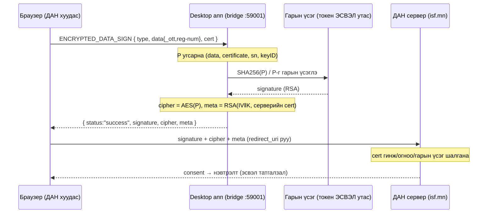

# ESIGN ↔ ДАН/isf.mn гүүрийн протокол

**Юу вэ:** ДАН (`sso.gov.mn` / `sso-api.isf.mn`)-ий нэвтрэх хуудсанд "Тоон гарын үсэг
(клиент програм)" сонголтоор нэвтрэхэд браузер нь `desktop` апп руу localhost WebSocket-оор
холбогдож нэг **гарын үсгийн хүсэлт** илгээдэг. Апп нь тухайн байт дээр гарын үсэг зурж,
серверийн cert-ээр битүүмжлээд буцаана. Энэ баримт нь **тэр хүсэлт яг юу авчирдаг, апп юу
хийж, юу буцаадаг**-ыг тайлбарлана.

Код: `Core/Esign/EsignBridge.swift` (ws + урсгал), `Core/Esign/EsignCrypto.swift` (P + seal),
`Core/Esign/EsignSigner.swift` (утасны гарын үсэг), `gerege-token-kit` (USB токен).

---

## 1. Транспорт

| Зүйл | Утга |
|---|---|
| Хаяг | `ws://127.0.0.1:59001` (зөвхөн loopback-д bind; LAN-д ил гарахгүй) |
| Протокол | RFC 6455 WebSocket, текст фрейм (`NWProtocolWebSocket`) |
| Чиглэл | Браузер (ДАН хуудас) = **клиент**, desktop апп = **сервер** |
| Амьдрал | Апп асахад автоматаар нээгдэнэ (`EsignBridge.start()`); нэг холболтоор олон хүсэлт явж болно |

> `wss://127.0.0.1:59005` (Windows гүүрт бий) macOS-д **алга** — `NWProtocolTLS` нь `SecIdentity`
> шаарддаг ба Security.framework-д localhost self-sign API байхгүй. Chrome/Edge нь https хуудаснаас
> `ws://127.0.0.1`-ыг зөвшөөрдөг тул хангалттай.

---

## 2. Бүтэн дараалал



---

## 3. Ирэх хүсэлт (браузер → апп)

Нэг текст JSON фрейм:

```json
{
  "type": "bb4702f31917793f",
  "data": {
    "_ott": "31d1abf7…-1feb…-39f5…",
    "reg-num": "ФА92040910"
  },
  "cert": "MIIEEDCCAvig…"
}
```

| Талбар | Тайлбар |
|---|---|
| `type` | Тогтмол `bb4702f31917793f` = **ENCRYPTED_DATA_SIGN** (`EsignBridge.expectedType`). Өөр type ирвэл апп `error` буцаана. |
| `data._ott` | ДАН-ий нэг удаагийн challenge (one-time token). **Заавал**; байхгүй бол `error`. Гарын үсэг зурсны дараа P дотор эргэж орох тул сервер challenge-аа таньдаг. |
| `data.reg-num` | Хэрэглэгчийн ДАН дээр бичсэн регистрийн дугаар (жишээ `ФА92040910`). Дэлгэцийн PIN prompt-д харуулахаас өөр **гарын үсэгт нөлөөлдөггүй** (доор § "reg-num-ий тухай"). |
| `cert` | **Серверийн** гэрчилгээ, base64 DER (`CN=sso.gov.mn`, олгосон `Mongolian National Issuing CA`). Хариуны `meta`-г ЭНЭ cert-ийн public key-ээр шифрлэнэ. Байхгүй/буруу бол `error`. |

`data` объект дотор нэмэлт талбар байж болно — бүгд P.data-д (indented JSON) орно.

---

## 4. Апп юу хийдэг (`EsignBridge.handle`)

1. **Шалгах:** `type == bb4702f31917793f`, `_ott` байгаа, `cert` уншигдана, апп **нэвтэрсэн** (identity).
2. **`data`-г indented JSON болгох** (`EsignCrypto.indentedJSON`) — `_ott` эхэнд, дараа `reg-num`,
   үлдсэнийг цагаан толгойгоор. Newtonsoft `JObject.ToString()`-той байт-нийцтэй (2 зай, CRLF, `": "`).
3. **Зам сонгох:** Тохиргоо → "USB токеноор зурах" toggle (`esign.useToken`) **АСААЛТТАЙ** ба токен
   залгаастай (`hasToken()`) бол **токен зам**, эс бөгөөс **утас зам**.
4. **P угсрах** (`EsignCrypto.payload`) — доор § 5.
5. **Гарын үсэг + битүүмжлэл** — доор § 6, § 7.

### P — гарын үсэг ба шифрлэлтийн ерөнхий эх байт

Compact JSON (талбарын дараалал ТОГТМОЛ, C#-тай ижил):

```
{"data":"<indented JSON string>","certificate":"<b64 DER>","sn":"<серийн>","keyID":"<b64>"}
```

| P талбар | Утга |
|---|---|
| `data` | § 4.2-ийн indented JSON-г **мөр болгон** (escape хийж) шигтгэсэн. Сервер үүнийг дотор нь дахин JSON гэж уншина. |
| `certificate` | **Гарын үсэг зурж буй** гэрчилгээ (base64 DER). Токен замд токены leaf, утасны замд иргэний eID cert. |
| `sn` | Тухайн cert-ийн серийн дугаар (ASN.1 INTEGER, тэргүүлэх `00` padding хасагдсан). |
| `keyID` | Cert-ийн SubjectKeyIdentifier, байхгүй бол public key-ийн SHA-1 (base64). `EsignCertParser.KeyId`-тэй ижил. |

> **Чухал:** гарын үсэг БА шифрлэлт хоёулаа **яг ижил P байт** дээр хийгдэнэ. Тиймээс P-г
> `JSONSerialization` (дараалал баталгаагүй) БИШ, гараар нэг л удаа байт болгоно.

---

## 5. Гарын үсэг — хоёр зам

### 5а. USB токен зам (`signViaToken`)

Нэг card session дотор бүрэн ESPK дараалал (Windows PC/SC трэйсээс задалж батлагдсан):

```
SM mutual auth  →  SELECT 00A40000 2003 (DF ENTERSAFE-ESPK)
  →  readESPKCertificates → leaf 24C0 (Tridium)   ← ЭНЭ cert-ээр P угсарна
  →  externalKeyAuth(PIN, kid 1)                   ← локал токены PIN (UI overlay)
  →  MSE:SET 00 22 41 B6 (80 01 82 · 81 02 A0 20)
  →  PSO HASH 00 2A 90 A0  (streaming TLV, доор)
  →  PSO SIGN 00 2A 9E 9A  →  RSA-2048 PKCS#1 v1.5, 256 байт
```

**PSO HASH streaming TLV** (`EsignPSOHash.hashTLV`) — карт SHA-256-г ӨӨРӨӨ finalize хийдэг тул host
зөвхөн midstate + сүүл өгнө (P ~2.6KB бөгөөд нэг APDU-д багтахгүй):

```
81 04 <бүтэн 64-байт БЛОКИЙН тоо, BE32>     ← 0x2C = 44 блок = 2816 байт
90 20 <тэр блокуудын дараах SHA-256 state, big-endian words 32B>
80 <n> <сүүлийн бүрэн бус блок = P[blocks·64 :]>
```
Карт: `SHA256_finalize(state, сүүл, нийт=(N·64+n)·8)` → digest → RSA sign. Гарах гарын үсэг нь
**токены cert-ийн public key-ээр** баталгаажна.

### 5б. Утас/eID зам (`EsignSigner.sign`)

Токенгүй — нэвтэрсэн иргэний eID threshold түлхүүрээр:

```
POST /api/esign-sign { personID, digestB64=SHA256(P), displayText }
  →  утас руу PIN2 push (баталгаажуулах код UI overlay-д)
  →  poll /api/status → COMPLETE/OK
  →  signature (SplitKey бол RSA-SHA256-PKCS1 ~512B, ECDSA бол ECDSA-SHA256 DER)
```

Гарын үсэг нь **иргэний eID cert-ийн** public key-ээр баталгаажна.

---

## 6. Битүүмжлэл (`EsignCrypto.seal`)

P-г серверт нууцаар хүргэхийн тулд:

```
K  = random 16B (AES-128),  IV = random 16B
cipher = AES-128-CBC / PKCS7 ( P, K, IV )
meta   = RSA-PKCS1v1.5 ( IV ‖ K )   — ХҮСЭЛТЭД ирсэн серверийн cert-ийн public key-ээр (IV эхэнд)
```

Сервер `meta`-г өөрийн хувийн түлхүүрээр тайлж `IV‖K` гаргаад `cipher`-ийг тайлж P-г сэргээнэ.

---

## 7. Буцах хариу (апп → браузер)

### Амжилт
```json
{
  "status": "success",
  "signature": "<b64 гарын үсэг>",
  "cipher": "<b64 AES(P)>",
  "meta": "<b64 RSA(IV‖K)>"
}
```

### Алдаа
```json
{ "status": "error", "message": "<Монгол тайлбар>" }
```

Алдааны шалтгаанууд: `type` танигдахгүй, `_ott`/`cert` алга, апп нэвтрээгүй, PIN цуцлагдсан,
токенд ESIGN cert олдоогүй, гэрчилгээ кэшлэгдээгүй г.м.

---

## 8. Сервер (ДАН) талд юу болдог

Браузер `signature`/`cipher`/`meta`-г ДАН-ий `redirect_uri` (`sso-api.isf.mn/sso-api/...`)
руу дамжуулна. ДАН:
1. `meta`→`IV‖K`→`cipher`→P тайлж, P.data._ott нь өөрийн challenge мөн эсэхийг шалгана.
2. P доторх `certificate`-ийн **гинж (CA), хүчинтэй хугацаа**-г шалгана.
3. `signature` нь P дээр, тэр cert-ийн public key-ээр зөв эсэхийг шалгана.
4. Бүгд зөв бол → **зөвшөөрлийн (consent) цонх** → нэвтрэлт.

---

## 9. Ажиглагдсан алдааны кейсүүд (2026-09-01, бодит isf.mn)

| ДАН-ий мессеж | Утга | Шалтгаан |
|---|---|---|
| **"Тоон гарын үсгийн мэдээлэл олдсонгүй"** | Клиент `status:error` буцаасан | Апп талын алдаа (нэвтрээгүй, PIN цуцалсан, буруу зам г.м.) |
| **"Таны тоон гэрчилгээ хүчин төгөлдөр бус"** | Cert-ийг хүлээж авахгүй | (а) cert **хугацаа дуссан**, ЭСВЭЛ (б) олгосон **CA-г ДАН итгэдэггүй** |
| *(алдаагүй → consent)* | Амжилттай | Cert хүчинтэй + CA итгэлцэлтэй + гарын үсэг зөв |

### CA итгэлцлийн бодит байдал

| Гарын үсгийн cert | Олгосон CA | Огноо | isf.mn |
|---|---|---|---|
| USB токен (Tridium leaf) | `Tridum Key Issuing SubCA` | хүчинтэй | ✅ **хүлээн авсан → бүрэн нэвтрэлт** |
| Утас/eID (SplitKey) | `eID Mongolia Issuing CA` (Gerege Systems) | хүчинтэй (2029 хүртэл) | ❌ **"хүчин төгөлдөр бус"** |

**Дүгнэлт:** клиент код хоёр замд зөв (гарын үсэг криптографаар баталгаажна). isf.mn нь одоогоор
**Tridium-ийн CA-г итгэдэг, eID Mongolia CA-г итгэдэггүй**. Утасны eID нэвтрэлт ажиллахад
`eID Mongolia Issuing CA`-г ДАН/isf.mn талд "хүлээн зөвшөөрөгдсөн тоон гарын үсэг" болгон
**бүртгүүлэх** шаардлагатай — засгийн газрын тал, кодоос гадуур.

---

## reg-num-ий тухай

Хүсэлтийн `data.reg-num` нь **гарын үсэгт нөлөөлдөггүй** — гарын үсэг үргэлж **тухайн cert-ийн
түлхүүрээр** (токены leaf эсвэл нэвтэрсэн иргэний eID) зурагдана. reg-num зөвхөн P.data-д орж,
дэлгэцийн PIN prompt-д харагдана. Бодит ДАН урсгалд хэрэглэгч ӨӨРИЙН РД-ээ бичдэг тул cert-ийн
эзэнтэй таарна; тестийн клиент (`e2e.py`) хатуу бичсэн бол зөрж харагдаж болзошгүй (гарын үсэгт
асуудалгүй).

---

## Локал тест

- **Fake-DAN клиент** (утас/токен аль ч зам): `e2e.py` (scratchpad) → `ws:59001` руу дээрх хүсэлт
  илгээж, буцсан гарын үсгийг тайлж cert-ийн public key-ээр OpenSSL-ээр шалгана.
- **Крипто нэгж:** `bash scripts/esign_interop_test.sh` — аппын P/seal-ийг OpenSSL-ээр тайлж тулгана.
- **Апп асаах** (токен/entitlement зөв ажиллахад): `open <.app>` (LaunchServices) — bare Mach-O бол
  smartcard entitlement болон UserDefaults domain эвдэрдэг.
